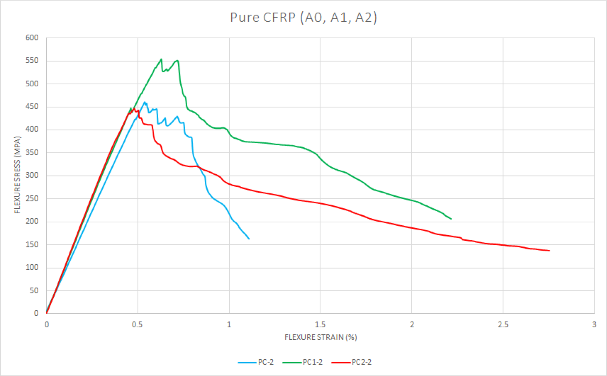
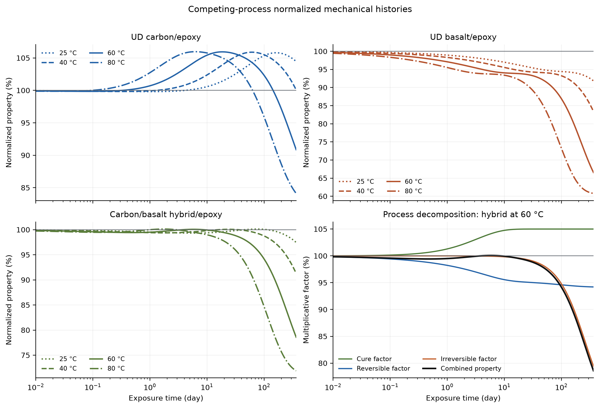

# Muhammad Shahroz · Research portfolio

[](https://github.com/Shahroz657/portfolio/actions/workflows/verify.yml)
[](LICENSE)
[](https://shahroz657.github.io/portfolio/)

Mechanical engineering graduate (NUST, 2024) preparing for doctoral research in mechanics of
materials, computational mechanics, scientific machine learning and digital twins, and in human-centered
AI systems and their evaluation. This repository holds the
portfolio site and the scripted finite-element studies; the research work is summarised below with
links to its reports and code. Site: **https://shahroz657.github.io/portfolio/**

## Research

### R1 · Environmental aging of basalt, carbon and hybrid epoxy laminates (thesis, 2023 to 2024)

NUST Materials Laboratory, advisor Dr. Zubair Sajid. Full-factorial durability study: four laminates
(pure basalt, pure carbon, C4B4 and C6B2 hybrids with basalt skins) × three exposure times × two ASTM
tests, three replicates, 72 specimens fabricated by hand lay-up and vacuum-bag curing at 60 °C. ASTM
D7264 three-point flexure and ASTM D2344 short-beam shear on a universal testing machine, about 1,000
measurements. Exposure in a marine bath at 40 °C and 3.5 % salinity (0, 10 and 20 days) and in a
hygrothermal chamber; both rigs designed in SolidWorks and controlled by Arduino with remote logging
because no commercial chamber was available.

Result: after 20 days, basalt-containing laminates lost 20 to 30 % of flexural strength and 10 to
20 % of interlaminar shear strength; pure carbon gained about 19 % flexural strength at 10 days and
fell back by 20 days. Unaged properties matched published values for the same fibre systems.
[Thesis report](https://drive.google.com/file/d/1eM4FNA7IN9RA6Dhap0gcsLwkUSNGvDQj/view).

<p align="center"></p>

### R2 · A competing-process model of hygrothermal aging in epoxy laminates (2026)

Independent extension of the thesis. Fickian and Langmuir (mobile/bound water) moisture transport
coupled to a bounded property model with continued post-cure, reversible plasticization and
irreversible damage, each with its own Arrhenius temperature dependence. Controlled carbon/epoxy,
basalt/epoxy and hybrid cases inside literature ranges, every parameter labelled measured, literature
range or prior. A 512-case Latin-hypercube sensitivity study and a sparse-data identifiability
experiment with multi-start inverse fitting. Six unit tests; the run is deterministic at a fixed seed.

Result: at 60 °C the carbon/epoxy case gains 5.9 % by day 18 and drops below its unaged value after
day 146; one-year retention is 91, 79 and 67 % for the three cases. Peak timing is governed by
plasticization sensitivity and cure rate, long-term retention by damage rate and capacity; gravimetry
recovers the transport parameters but cannot separate cure amplitude from cure rate.
Code and report: **https://github.com/Shahroz657/composite-hygrothermal-aging**

<p align="center"></p>

### R3 · Forecasting air quality in Lahore from twenty years of atmospheric data (2024)

Copernicus CAMS reanalysis, 2003 to 2022, eight pollutants and temperature, about 65,000 monthly
values. ADF stationarity test, STL decomposition, walk-forward validation; ARIMA selected by AIC,
SARIMAX, STL baselines and XGBoost tuned by grid search, scored by MSE and dynamic time warping.
ARIMA(0,1,0) scored best (MSE 3.7e-4, DTW 1.19), about 30 % lower error than the alternatives: the
series behaves like a random walk with strong winter seasonality.
[Manuscript](https://docs.google.com/document/d/1TF4qh9-M5R43Pwvi0iUeYt-q1BlmLZnx/edit).

## Applied AI

### A1 · Evaluating frontier models (2024 to present)

Part-time on AI evaluation teams. micro1 (2025 to present): expert-level engineering tasks with
rubric-graded reference solutions that benchmark frontier language models, grounded in ASTM, ISO and
ASME standards. Mercor (2026): led about 100 reviewers evaluating models on schematics and scientific
images, with calibration and quality control. Turing (2024 to 2025): multimodal model evaluation,
including adversarial prompts. Under NDA, so described rather than shown.

### A2 · SereniMind, a mental-health support chatbot (February 2025)

Team of five at the lablab.ai "Fall in Love with DeepSeek" hackathon: conversation memory, per-user
history, authentication and crisis handling, with deepseek-r1 served through Ollama behind a FastAPI
backend and a React front end. Built to encourage self-help and hand off to professional help, not
replace it. [Project page](https://lablab.ai/event/fall-in-love-with-deepseek/robinhood/serenimind) ·
[Code](https://github.com/MateehUllah/SereniMind)

### A3 · Sensing rigs with real-time logging (2023 to 2024)

Two aging chambers built for the thesis when the lab had none: Arduino and ESP32 controllers, DHT22
sensors, a PID-controlled heater and real-time logging to Firebase, with a SolidWorks model of the
marine rig. The same pipeline as a wearable study of worker health, which is where I want to take it
next. Earlier, a 5-DOF motion-controlled robotic arm on a mobile platform with 3D-printed structure,
sensors and Bluetooth control. Also: connectivity-demand prediction for schools and hospitals, AI for
Connectivity Hackathon, top 6 worldwide
([code](https://github.com/Shahroz657/ai-connectivity-healthcare-education)).

## Simulation studies

Scripted finite-element engineering in Python: geometry from code (CadQuery, Gmsh OCC), meshes from
the Gmsh API, plain-text CalculiX decks, solver runs from the command line, results parsed into NumPy,
and **every model verified against a closed-form solution with executable PASS/FAIL checks**. No
graphical interface is used anywhere in the pipeline. The quick projects re-run in GitHub Actions on
every push.

### The seven studies

| # | Project | Physics | Toolchain | Verified result (from the committed run) |
|---|---|---|---|---|
| 01 | [Cantilever verification and element convergence](projects/01_cantilever_verification) | linear static, 3D solids | Gmsh structured hex/tet → CalculiX | 22 runs; converged C3D20R tip deflection 0.9964 × Timoshenko, bending stress 135.0 vs 135.0 MPa; shear locking (C3D8) and hourglassing (C3D8R, 27.7 × too flexible) reproduced |
| 02 | [Plate with a hole: Kt sweep](projects/02_plate_with_hole_stress_concentration) | 2D plane stress, stress concentration | Gmsh size fields → CalculiX CPS8 | Kt within 1.4–2.0 % of Peterson's chart for d/W = 0.1–0.6, peak at θ = 0°, converged to 0.09 % |
| 03 | [Modal and buckling analysis](projects/03_modal_and_buckling) | vibration, linear buckling | CalculiX `*FREQUENCY`, `*BUCKLE` | 12 runs; 10 modes classified automatically, first weak-axis mode 51.06 vs 50.96 Hz, every bending mode within 0.31 % of exact Timoshenko; first buckling load 5150 vs 5140 N (+0.19 %); a CalculiX `*BUCKLE` conditioning pitfall isolated and documented |
| 04 | [Pin-fin heat transfer](projects/04_pin_fin_heat_transfer) | steady conduction + convection | Gmsh OCC cylinder → CalculiX heat transfer | 10 solves; centre-line temperature within 0.014 °C of Incropera's convective-tip solution, heat rate within 0.22 % as printed and 0.015 % after correcting CalculiX's reaction-flux bookkeeping (traced node by node), energy balance closed to 9e-5 % |
| 05 | [L-bracket design optimisation](projects/05_bracket_design_optimization) | static strength, stiffness, mass | CadQuery → STEP → Gmsh → CalculiX → SciPy | 41 solves: 35-point DOE, response surfaces (R² 0.999), SLSQP optimum t = 7.19 mm, R = 10 mm verified by FE at SF 2.56 and 0.590 mm, 26.9 % lighter than the thick-plate baseline; fillet stress converged to 0.8 % while the fixed-edge singularity grew 21 % |
| 06 | [Reviewing an AI-generated FEA solution](projects/06_ai_solution_review) | review, singularities, units | CalculiX, executable checks | 7 of 8 objective checks fail on the AI solution: units (deflection 2·10⁶ × too small), non-converged singular maximum (+62 % under refinement), wrong strength criterion (SF 5.01 → 1.83) |
| 07 | [Fatigue life estimation](projects/07_fatigue_life_estimation) | stress-life fatigue | NumPy, own ASTM E1049 rainflow | rainflow count identical to the reference package in every bin (1082.5 cycles/block); four mean-stress corrections span a factor of 5.05 in life; constant-amplitude chain reproduces N(S) exactly |

Each project folder has a `run.py` that regenerates everything in `results/` (figures, CSV tables,
`summary.json` with a `checks` dictionary) and exits non-zero if any check fails, plus a README that
states the model, the reference equations, the numbers and the limitations.

## How every study is built

```
CadQuery / Gmsh OCC  ->  Gmsh API mesh  ->  CalculiX deck (text)  ->  ccx (CLI)  ->  .frd / .dat parsers
        geometry         2nd-order hex/tet     BCs, loads, steps       solver         NumPy arrays
                                                                                          |
                     closed-form reference  <-------------------------------------  verify + checks
```

The shared package [`fealib/`](fealib) is small on purpose and fully readable:

- [`fealib/mesh.py`](fealib/mesh.py) – Gmsh session helper, structured/unstructured box meshers, conversion of
  any Gmsh model to CalculiX element types with the node-order permutations (C3D20, C3D10, C3D15, CPS8…),
  physical groups → node/element sets, element-face lists for pressure/film loads, **consistent nodal loads**
  for uniform tractions on quadratic faces
- [`fealib/ccx.py`](fealib/ccx.py) – deck text helpers, solver runner (fails loudly on `*ERROR`), `.frd`
  parser (any nodal block: DISP, STRESS, NDTEMP…), `.dat` parser (eigenfrequencies, buckling factors,
  reaction totals), von Mises / principal stresses
- [`fealib/analytic.py`](fealib/analytic.py) – Timoshenko/Euler beams, cantilever modes, Euler buckling,
  Peterson and Kirsch stress concentration, Incropera fins, Lamé cylinders
- [`tests/`](tests) – unit tests for the parsers, the mesh conversion and the closed forms, plus an
  end-to-end CalculiX run compared with Timoshenko

## Running it yourself

```bash
git clone https://github.com/Shahroz657/portfolio
cd portfolio
python -m venv .venv && source .venv/bin/activate      # Python 3.10-3.12
pip install -e ".[dev]"                                # numpy, scipy, gmsh, cadquery, matplotlib, pytest ...
python -m pytest -q
cd projects/01_cantilever_verification && python run.py
```

CalculiX (`ccx`) is found on `PATH`, in `$CCX`, or inside a FreeCAD bundle:

| Platform | Command |
|---|---|
| Ubuntu / Debian | `sudo apt install calculix-ccx libglu1-mesa libxrender1 libxcursor1 libxft2 libxinerama1` |
| macOS | `brew install calculix-ccx` or `export CCX=/Applications/FreeCAD.app/Contents/Resources/bin/ccx` |
| any | set `CCX=/path/to/ccx` |

Gmsh comes from the `gmsh` wheel on PyPI (no separate install). Versions used for the committed
results: CalculiX 2.22, Gmsh 4.13/4.15, CadQuery 2.8, Python 3.12, macOS arm64.

## Earlier CAD work

Before this repository my design work lived in SolidWorks and PTC Creo: the Ventus-I agricultural
hexacopter (design lead, seven-person team, IMechE UAS Challenge), a V6 twin-turbo engine assembly
(Creo, team of four), and personal modelling and rendering projects. Renders are on the
[portfolio site](https://shahroz657.github.io/portfolio/#cad).

## About

B.E. Mechanical Engineering, National University of Sciences and Technology (NUST), 2024, with a
thesis on environmental aging of hybrid composites. MIT Emerging Talent certificate in computer and
data science, 2025 (selected from about 8,700 applicants). Honors: top 6 worldwide in the AI for
Connectivity Hackathon, Stanford Code in Place 2024, Harvard CS50 Puzzle Day 2025 (9 of 9), Aspire
Leaders Program 2024, UN Millennium Fellowship 2024. Internships at DTnEC (digital twin of pipeline
design) and the CEME Centre for Research and Innovation (CAD and FEA for an electric-vehicle
conversion). Alongside, since 2024, part-time technical researcher designing engineering evaluation
tasks for AI-training teams (micro1; earlier Mercor and Turing).

Seeking a funded PhD position starting Spring or Fall 2027 in mechanics of materials, computational
mechanics, scientific machine learning (surrogate and physics-informed models, uncertainty
quantification), or digital twins and data-driven monitoring of engineering systems.
[CV](docs/cv/Shahroz_CV.pdf) · [LinkedIn](https://www.linkedin.com/in/shahroz657) ·
[GitHub](https://github.com/Shahroz657) · muhammadshahroz657@gmail.com

## License

MIT. Result figures and tables in `projects/*/results` are produced by the scripts and may be reused
with attribution.
