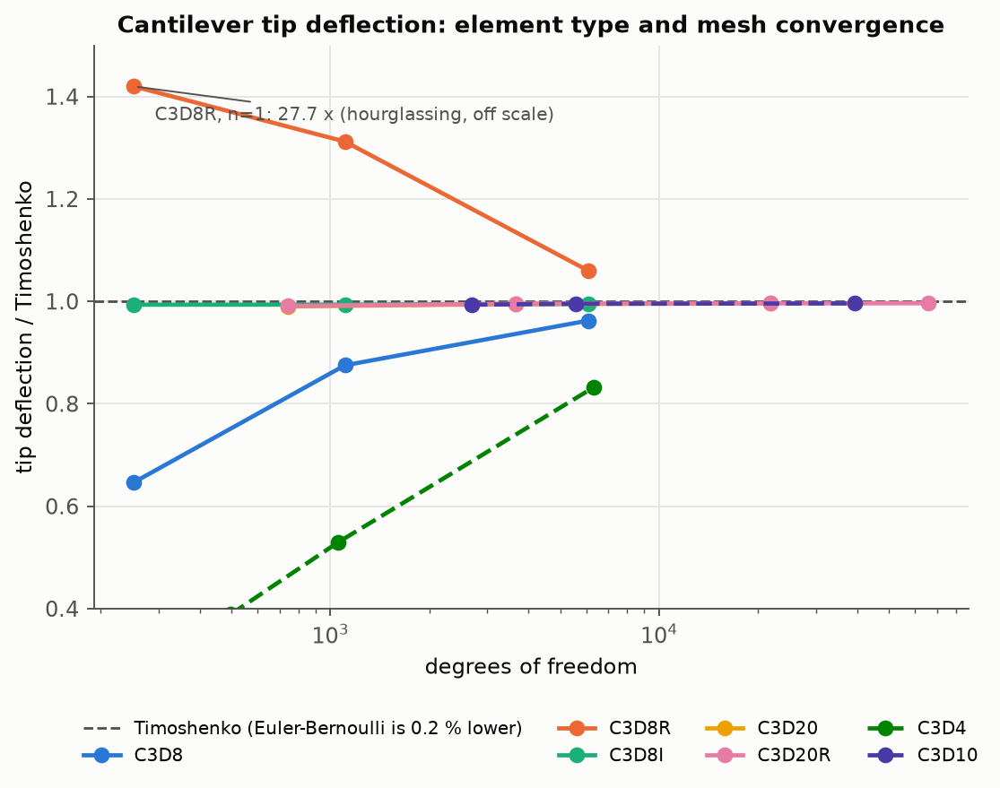
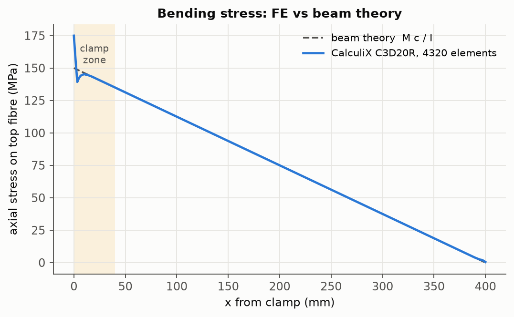
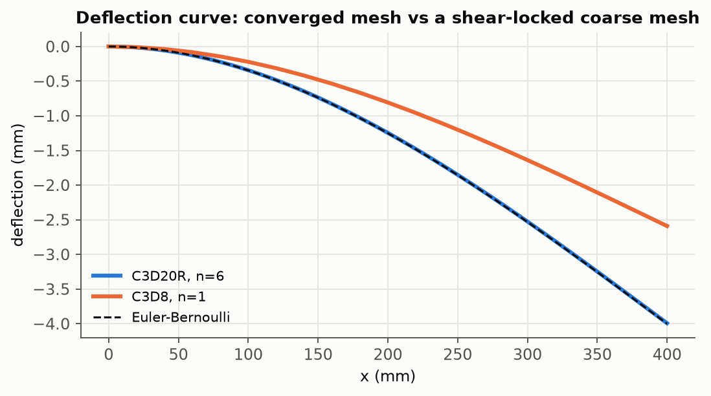

# 01 · Cantilever beam: verification against beam theory, element choice and mesh convergence

**Question answered.** For a problem with a known closed-form answer, how close does a scripted
Gmsh → CalculiX pipeline get, which element formulations can be trusted at which mesh density, and
can the run be judged objectively (equilibrium, convergence, error bounds) instead of by eye?

Everything here is produced by [`run.py`](run.py): geometry and mesh (Gmsh Python API), CalculiX
deck, solver call, `.frd`/`.dat` parsing, comparison with theory, figures and PASS/FAIL checks.

## Model

| Item | Value |
|---|---|
| Geometry | 400 × 20 × 20 mm steel bar, clamped at x = 0 |
| Material | E = 200 GPa, ν = 0.30, linear elastic |
| Load | 500 N transverse (−z) on the free end, applied as a uniform shear traction through **consistent nodal loads** (corner nodes of 20-node elements receive −1/12 of the face force, midside nodes +1/3; resultant exactly 500 N) |
| Boundary condition | all three translations fixed on the clamped face |
| Elements | structured hex C3D8, C3D8R, C3D8I, C3D20, C3D20R with 1, 2, 4 (and 6) elements through the depth and cubic aspect ratio; unstructured tets C3D4 and C3D10 with edge length H/1, H/2, H/4 |
| Solver | CalculiX 2.22, linear static, one step |

## Reference solution

- Euler–Bernoulli tip deflection: `δ = P L³ / (3 E I)` = **4.000 mm** (`I = b h³/12 = 1.333e-8 m⁴`)
- Timoshenko adds transverse shear: `δ = P L³ / (3 E I) + P L / (κ G A)` = **4.008 mm**,
  with Cowper's `κ = 10 (1+ν) / (12 + 11 ν)` = 0.8497 and `G = E / (2 (1+ν))`
- Bending stress on the top fibre: `σ = M c / I = P (L − x) c / I`, 150 MPa at the clamp and
  **135 MPa at the checkpoint x = 2H = 40 mm** (chosen outside the Saint-Venant zone of the clamp)

## Results

Converged model (C3D20R, 4320 elements, 65 919 DOF): tip deflection **3.993 mm = 0.9964 × Timoshenko**
and top-fibre stress at x = 2H **135.0 MPa vs 135.0 MPa** (−0.003 %). The remaining 0.36 % stiffness
excess is physical, not numerical: a fully clamped face suppresses Poisson contraction, which a
beam-theory clamp does not. All 22 runs return a clamp reaction of exactly 500.000 N.

| Element | Layers through depth | DOF | δ / δ_Timoshenko | σ error at x = 2H |
|---|---:|---:|---:|---:|
| C3D8 (full integration) | 1 | 252 | 0.646 | −24.2 % |
| C3D8 | 4 | 6 075 | 0.963 | +0.7 % |
| C3D8R (reduced integration) | 1 | 252 | **27.7** | −100 % |
| C3D8R | 4 | 6 075 | 1.060 | −20.2 % |
| C3D8I (incompatible modes) | 1 | 252 | 0.994 | +0.5 % |
| C3D20R | 1 | 744 | 0.991 | 0.0 % |
| C3D20R | 6 | 65 919 | 0.996 | 0.0 % |
| C3D4 (linear tet) | H/4 edge | 6 339 | 0.825 | −26.5 % |
| C3D10 (quadratic tet) | H/4 edge | 39 351 | 0.996 | 0.0 % |

Full table: [`results/convergence.md`](results/convergence.md) · raw data: [`results/convergence.csv`](results/convergence.csv)







## What the study shows (engineering reading)

- **Shear locking.** Fully integrated linear hexes (C3D8) with one element through the depth carry
  only 65 % of the true deflection; even four layers are 4 % stiff. Linear tets (C3D4) are worse
  (46–82 %) and should never be used for bending-dominated parts.
- **Hourglassing.** Reduced-integration C3D8R with a single layer returns a deflection **27.7 times**
  too large and zero bending stress: a zero-energy mode, with no solver warning. This is the kind of
  result that must be caught by a sanity check against a hand calculation.
- **Formulations that work.** Incompatible-mode C3D8I and quadratic C3D20/C3D20R/C3D10 are within
  1 % of Timoshenko even at the coarsest mesh, and converge monotonically from below.
- **Where theory and FE legitimately differ.** The top-fibre stress follows `M c / I` exactly
  beyond ~1 depth from the clamp; inside the shaded clamp zone the 3D stress state deviates
  (Saint-Venant), which is why the checkpoint sits at 2H, not at the wall.

## Checks (all PASS in the committed run)

- equilibrium: sum of clamp reactions equals the applied load in every run (error < 1e-6)
- converged C3D20R tip deflection within 1 % of Timoshenko
- converged C3D20R bending stress within 2 % of `M c / I` at x = 2H
- C3D20R converges monotonically with refinement
- shear locking reproduced: single-layer C3D8 under-predicts deflection by more than 20 %

## How to run

```bash
cd projects/01_cantilever_verification
python run.py          # ~1 min; writes results/, scratch decks in work/
```

Requires the repository environment (`pip install -e .`) and a `ccx` executable on PATH or in `$CCX`.

## Limitations

Linear elastic, small displacement; the tip traction is uniform rather than the parabolic shear
distribution of exact beam theory (Saint-Venant makes this irrelevant beyond one depth from the
tip); nodal stresses are extrapolated from integration points and averaged, as in any FE
post-processor.
