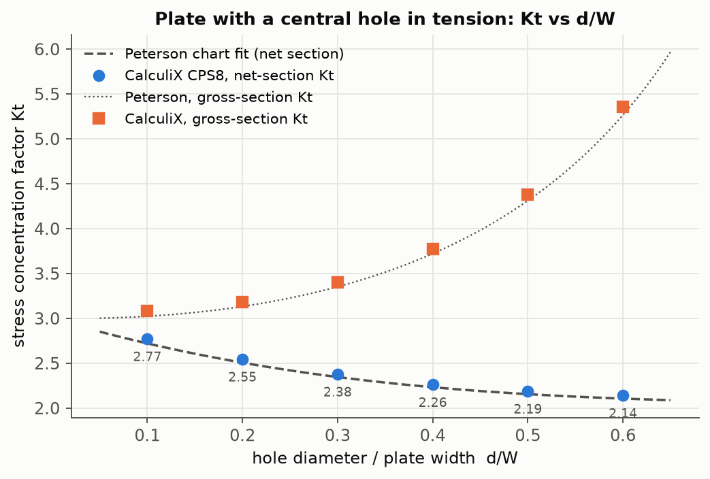
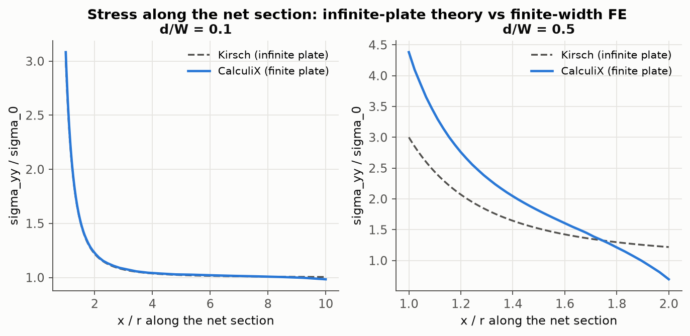
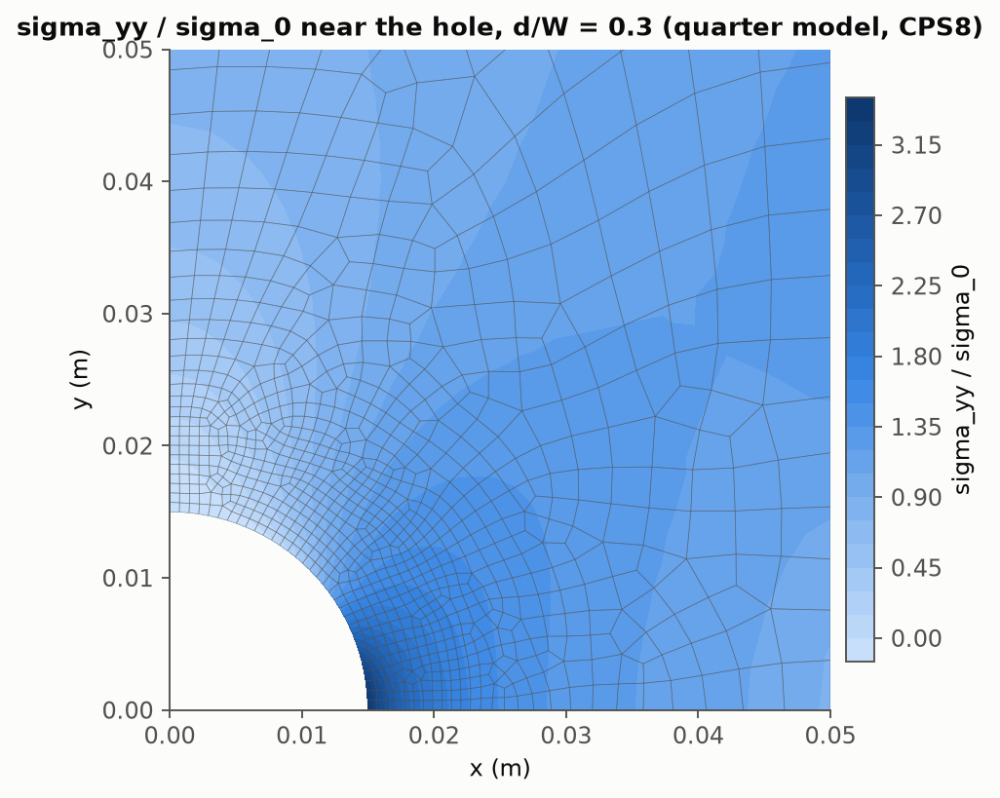
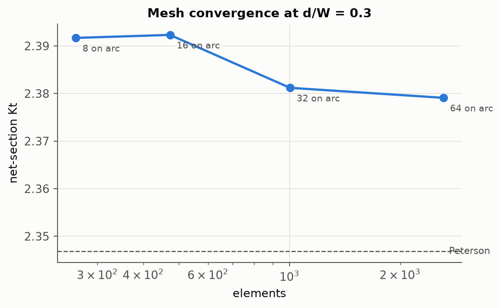

# 02 · Plate with a circular hole: stress-concentration sweep in 2D plane stress

**Question answered.** Does a scripted quarter-symmetry plane-stress model reproduce the textbook
stress-concentration factor of a plate with a central hole across a range of hole sizes, where
exactly does the peak occur, and how fine must the mesh be at the hole for Kt to be converged?

[`run.py`](run.py) builds the geometry with the Gmsh OCC kernel (rectangle minus disk), refines the
mesh with a distance-threshold size field around the hole, writes the CalculiX deck (CPS8 elements,
symmetry conditions, far-field traction as a negative pressure on the top edge), runs the sweep and
the convergence series, and compares with two references.

## Model

| Item | Value |
|---|---|
| Plate | width W = 100 mm, thickness 5 mm, modelled half-length 200 mm (far field at ≥ 4 diameters) |
| Symmetry | quarter model: u_x = 0 on x = 0, u_y = 0 on y = 0 |
| Load | σ₀ = 100 MPa uniform tension on the far edge |
| Material | E = 200 GPa, ν = 0.30 |
| Elements | 8-node plane-stress quads (CPS8) from recombined Frontal-Delaunay meshing, 32 elements along the quarter arc in the sweep |
| Sweep | d/W = 0.1 … 0.6 |

## References

- **Peterson / Pilkey** finite-width fit, net-section nominal stress:
  `Kt_net = 3.000 − 3.140 (d/W) + 3.667 (d/W)² − 1.527 (d/W)³`, and `Kt_gross = Kt_net / (1 − d/W)`
- **Kirsch** infinite-plate field along the net section: `σ_yy(x) / σ₀ = 1 + a²/(2x²) + 3a⁴/(2x⁴)`

## Results

| d/W | elements | Kt gross | Kt net (FE) | Kt net (Peterson) | difference | peak angle |
|---:|---:|---:|---:|---:|---:|---:|
| 0.1 | 696 | 3.083 | 2.775 | 2.721 | +2.0 % | 0.0° |
| 0.2 | 862 | 3.185 | 2.548 | 2.506 | +1.7 % | 0.0° |
| 0.3 | 1003 | 3.401 | 2.381 | 2.347 | +1.5 % | 0.0° |
| 0.4 | 1101 | 3.773 | 2.264 | 2.233 | +1.4 % | 0.0° |
| 0.5 | 1128 | 4.382 | 2.191 | 2.156 | +1.6 % | 0.0° |
| 0.6 | 1073 | 5.357 | 2.143 | 2.106 | +1.8 % | 0.0° |

Data: [`results/kt_sweep.csv`](results/kt_sweep.csv) · [`results/kt_convergence.csv`](results/kt_convergence.csv)

The FE values sit a consistent 1.4–2.0 % above the chart polynomial, which is itself a fit to
Howland's series solution with an accuracy of about that order; the peak is found at θ = 0° (on the
net section) in every case, and the symmetry-plane reaction balances the applied edge load to
machine precision.





Along the net section the finite plate follows Kirsch's infinite-plate curve almost exactly for
d/W = 0.1; for d/W = 0.5 the stress is higher everywhere because the net section carries the full
load through less material, and it no longer decays to σ₀ at the edge, which is precisely the
finite-width effect the Peterson correction accounts for.



**Mesh convergence at d/W = 0.3.** Kt_net = 2.392, 2.392, 2.381, 2.379 for 8, 16, 32, 64 elements on the
quarter arc (262 → 2621 elements): the change between the two finest meshes is 0.09 %, so the sweep
mesh (32 on the arc) is converged to well under 1 %.



## Checks (all PASS in the committed run)

- equilibrium: symmetry-plane reaction equals the applied edge load in every run (error < 1e-6)
- net-section Kt within 3 % of Peterson's fit for every d/W
- the peak stress sits on the net section (θ < 3°)
- Kt changes by less than 0.5 % between the two finest meshes
- d/W → 0 limit: gross Kt at d/W = 0.1 within 2 % of Kirsch's value corrected for finite width

## How to run

```bash
cd projects/02_plate_with_hole_stress_concentration
python run.py          # ~10 s
```

## Engineering notes

Plane stress is appropriate because thickness/width = 0.05; a 3D model would only add the small
through-thickness variation of the peak. Nodal stresses are extrapolated from integration points,
so peak values carry a small positive bias at coarse meshes (visible in the convergence series).
Symmetry conditions halve the DOF twice but suppress antisymmetric modes, which is fine for a
linear static tension case and would not be for buckling or modal work.
