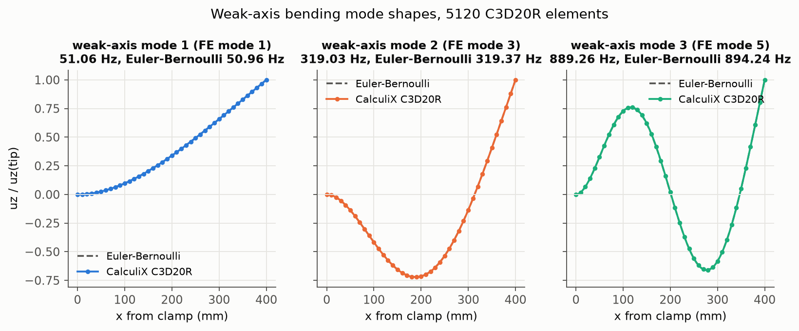
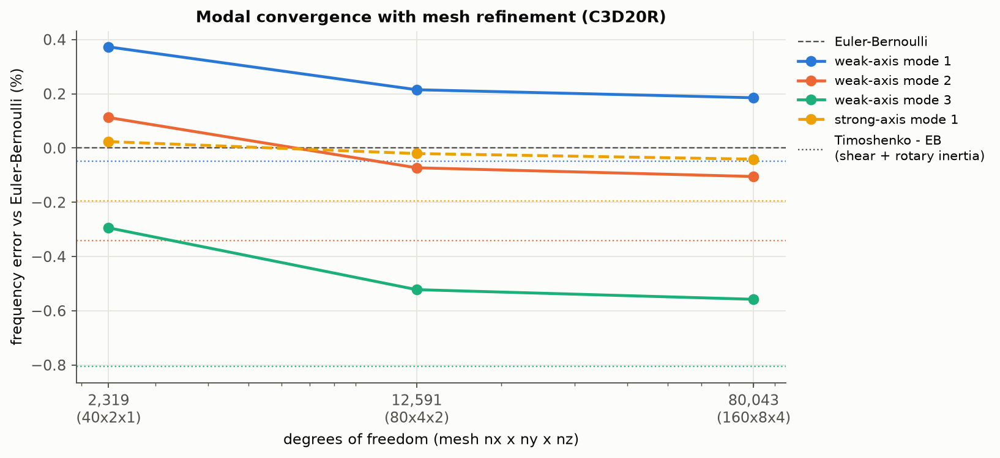
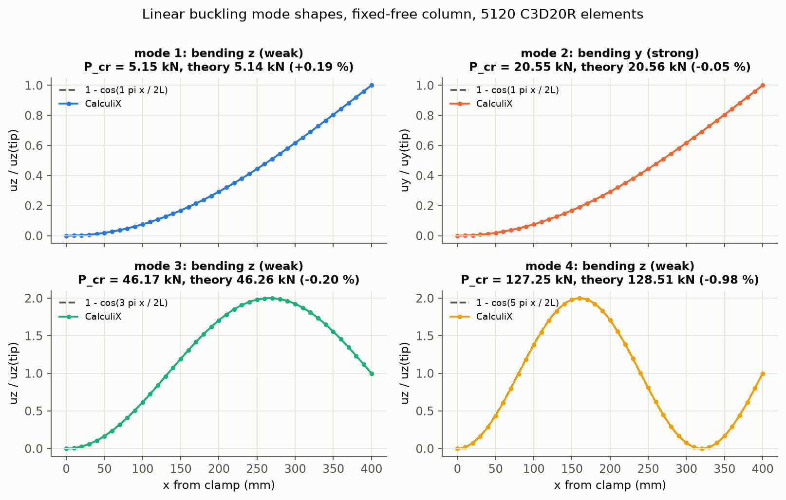

# Project 03 - Modal and linear buckling analysis of a steel cantilever

Natural frequencies, mode shapes and linear buckling loads of a slender steel cantilever computed with
scripted Gmsh + CalculiX solid models (`run.py`) and verified against closed-form beam theory. Every FE mode is
classified automatically from its displacement pattern, the bending modes are compared with the
Euler-Bernoulli cantilever frequencies (and, to quantify shear deformation and rotary inertia, with the exact
Timoshenko solution), and the buckling factors are compared with the Euler fixed-free column loads. The
script also documents a CalculiX pitfall found on the way: the `*BUCKLE` factors are only accurate when the
reference load is chosen so that the factors are of order one.

## Model

| item | value |
|:--|:--|
| geometry | L = 400 mm, width B = 20 mm (y), depth H = 10 mm (z); weak axis bends in z |
| section properties | A = 2.0e-4 m^2, I_weak = B H^3/12 = 1.667e-9 m^4, I_strong = H B^3/12 = 6.667e-9 m^4, J = 4.574e-9 m^4, I_p = 8.333e-9 m^4 |
| material | E = 200 GPa, nu = 0.30, rho = 7850 kg/m^3 (G = 76.9 GPa, kappa = 0.850) |
| elements | C3D20R (20-node hexahedra, reduced integration), Gmsh transfinite box mesh |
| meshes (nx x ny x nz) | 40x2x1 (80 elements, 2,319 DOF), 80x4x2 (640 elements, 12,591 DOF), 160x8x4 (5,120 elements, 26,681 nodes, 80,043 DOF), i.e. 10, 5 and 2.5 mm cubes |
| boundary condition | all three displacements fixed at every node of the x = 0 face |
| Part A | `*FREQUENCY`, 10 modes, on all three meshes |
| Part B | `*BUCKLE`, 4 modes, uniform compressive pressure of 10 MPa on the x = L face applied inside the buckle step, i.e. P_ref = 10 MPa x B x H = 2.0 kN and P_cr,n = lambda_n x P_ref; run on all three meshes, results quoted from 160x8x4 |

The reference pressure is 10 MPa rather than the unit pressure originally planned because CalculiX returns
inaccurate buckling factors when they are many orders of magnitude away from one (see the reference-load
study in Part B). With 10 MPa the first factor is 2.58.

## Verification

Closed-form references (all evaluated in `run.py`, error % = 100 (FE - theory) / theory):

- Euler-Bernoulli cantilever bending: `f_n = (beta_n L)^2 / (2 pi L^2) * sqrt(E I / (rho A))`, with
  beta_n L = 1.8751, 4.6941, 7.8548, 10.996, 14.137; I = I_weak for z motion, I = I_strong for y motion.
- Timoshenko cantilever (shear deformation with kappa = 10 (1 + nu) / (12 + 11 nu) and rotary inertia): exact
  roots of the clamped-free frequency determinant, `W'''' + (a + c) W'' - a (b - c) W = 0` on xi = x/L with
  a = rho w^2 L^2 / (kappa G), b = kappa G A L^2 / (E I), c = rho I w^2 L^2 / (E I).
- Saint-Venant torsion of a fixed-free shaft (free warping): `f_n = (2n - 1) / (4 L) * sqrt(G J / (rho I_p))`,
  J from the rectangular-section series (J = 0.2287 B H^3), I_p = A (B^2 + H^2) / 12.
- Axial rod: `f_n = (2n - 1) / (4 L) * sqrt(E / rho)`.
- Fixed-free column (effective length 2L): `P_cr,n = (2n - 1)^2 pi^2 E I / (4 L^2)`; Engesser shear
  correction `P_cr,s = P_cr / (1 + P_cr / (kappa G A))` with kappa G A = 13.07 MN.
- Mode shapes: `phi_n(x) = cosh(beta_n x) - cos(beta_n x) - sigma_n (sinh(beta_n x) - sin(beta_n x))` for
  bending, `1 - cos((2n - 1) pi x / (2 L))` for the buckled column.

Mode classification: at every x-station the section-mean ux, uy, uz and the least-squares rigid rotation
theta about x are computed; the largest of max|ux|, max|uy|, max|uz| and max|theta| x r_corner decides
between axial, strong-axis bending (y), weak-axis bending (z) and torsion (a 2:1 margin is required,
otherwise the mode is "other"). The k-th mode of a class is compared with the k-th closed-form value.

### Part A - natural frequencies and mode shapes

Finest mesh (160x8x4, 80,043 DOF), all ten modes (`results/modal_table.md`):

|   mode | classification     |   f_FE_Hz |   f_theory_Hz | theory               |   err_pct |   f_timoshenko_Hz |   err_vs_timoshenko_pct |
|-------:|:-------------------|----------:|--------------:|:---------------------|----------:|------------------:|------------------------:|
|      1 | bending z (weak)   |     51.06 |         50.96 | Euler-Bernoulli      |     0.185 |             50.94 |                   0.235 |
|      2 | bending y (strong) |    101.88 |        101.92 | Euler-Bernoulli      |    -0.041 |            101.72 |                   0.155 |
|      3 | bending z (weak)   |    319.03 |        319.37 | Euler-Bernoulli      |    -0.105 |            318.28 |                   0.237 |
|      4 | bending y (strong) |    631.18 |        638.74 | Euler-Bernoulli      |    -1.183 |            630.17 |                   0.161 |
|      5 | bending z (weak)   |    889.26 |        894.24 | Euler-Bernoulli      |    -0.558 |            887.04 |                   0.25  |
|      6 | torsion x          |   1457.18 |       1449.42 | Saint-Venant torsion |     0.536 |              -    |                   -     |
|      7 | bending z (weak)   |   1731.31 |       1752.36 | Euler-Bernoulli      |    -1.201 |           1726.56 |                   0.275 |
|      8 | bending y (strong) |   1736.19 |       1788.48 | Euler-Bernoulli      |    -2.924 |           1733.11 |                   0.177 |
|      9 | bending z (weak)   |   2838.49 |       2896.77 | Euler-Bernoulli      |    -2.012 |           2829.76 |                   0.309 |
|     10 | axial x            |   3158.27 |       3154.72 | axial rod            |     0.113 |              -    |                   -     |

Mesh convergence of the four checked modes (`results/modal_convergence.md`):

| mesh    |   elements |   dofs |   f_weak1_Hz |   err_weak1_pct |   f_weak2_Hz |   err_weak2_pct |   f_weak3_Hz |   err_weak3_pct |   f_strong1_Hz |   err_strong1_pct |   solve_s |
|:--------|-----------:|-------:|-------------:|----------------:|-------------:|----------------:|-------------:|----------------:|---------------:|------------------:|----------:|
| 40x2x1  |         80 |   2319 |       51.151 |           0.373 |      319.728 |           0.112 |      891.612 |          -0.294 |        101.947 |             0.024 |      0.08 |
| 80x4x2  |        640 |  12591 |       51.071 |           0.215 |      319.136 |          -0.073 |      889.574 |          -0.522 |        101.902 |            -0.02  |      0.62 |
| 160x8x4 |       5120 |  80043 |       51.056 |           0.185 |      319.034 |          -0.105 |      889.256 |          -0.558 |        101.881 |            -0.041 |      7.21 |





Observations:

- On the finest mesh the first three weak-axis frequencies are within +0.19 %, -0.11 % and -0.56 % of
  Euler-Bernoulli and the first strong-axis frequency within -0.04 %. The mode shapes coincide with the
  analytical cantilever shapes (the dashed curves are hidden under the FE markers).
- The deviation from Euler-Bernoulli becomes increasingly negative with mode number: +0.19, -0.11, -0.56,
  -1.20, -2.01 % for weak-axis modes 1-5 and -0.04, -1.18, -2.92 % for strong-axis modes 1-3. This is
  physical, not a discretisation error: Euler-Bernoulli theory ignores shear deformation and rotary inertia,
  which lower the frequencies of the shorter-wavelength modes. The exact Timoshenko solution places the modes
  at -0.05, -0.34, -0.81, -1.47 and -2.31 % (weak axis) and -0.20, -1.34 and -3.10 % (strong axis, deeper
  section, therefore larger correction) relative to Euler-Bernoulli, i.e. it explains the whole trend.
- Relative to Timoshenko every bending mode lies between +0.11 % and +0.31 %, a nearly constant offset. It
  is the fully clamped face: fixing all three displacements suppresses the Poisson contraction and the
  anticlastic curvature at the root, which stiffens the beam slightly compared with the ideal beam-theory
  clamp. It is not a mesh effect: mode 1 moved by only 0.03 % between the 12.6k- and the 80k-DOF meshes.
- The torsional mode is 0.54 % above Saint-Venant theory, which assumes free warping; the clamp restrains
  warping and adds stiffness. The axial mode is 0.11 % above the rod value for the same clamp reason.
- Convergence: mode 1 goes 51.151 -> 51.071 -> 51.056 Hz, monotonically decreasing with shrinking steps
  (-0.080 Hz, then -0.015 Hz), the expected upper-bound behaviour of a displacement-based model. Even a single
  C3D20R element through the depth is within 0.4 % for mode 1.

### Part B - linear buckling

Finest mesh, four modes (`results/buckling_table.md`; P_cr,FE = lambda x 2.0 kN):

|   mode | classification     |   buckling_factor |   P_cr_FE_N |   P_cr_theory_N |   err_pct |   P_cr_engesser_N |   err_vs_engesser_pct |
|-------:|:-------------------|------------------:|------------:|----------------:|----------:|------------------:|----------------------:|
|      1 | bending z (weak)   |           2.57506 |      5150.1 |          5140.4 |     0.189 |            5138.4 |                 0.228 |
|      2 | bending y (strong) |          10.2757  |     20551.4 |         20561.7 |    -0.05  |           20529.4 |                 0.107 |
|      3 | bending z (weak)   |          23.0847  |     46169.4 |         46263.8 |    -0.204 |           46100.6 |                 0.149 |
|      4 | bending z (weak)   |          63.6263  |    127253   |        128510   |    -0.979 |          127259   |                -0.005 |

Mesh convergence (`results/buckling_convergence.md`):

| mesh    |   dofs |   P_cr1_N |   err1_pct |   P_cr2_N |   err2_pct |   P_cr3_N |   err3_pct |   P_cr4_N |   err4_pct |   solve_s |
|:--------|-------:|----------:|-----------:|----------:|-----------:|----------:|-----------:|----------:|-----------:|----------:|
| 40x2x1  |   2319 |    5159.7 |      0.376 |   20564.3 |      0.013 |   46275.2 |      0.025 |    127651 |     -0.669 |      0.06 |
| 80x4x2  |  12591 |    5151.6 |      0.218 |   20555.6 |     -0.03  |   46183.9 |     -0.173 |    127299 |     -0.943 |      0.53 |
| 160x8x4 |  80043 |    5150.1 |      0.189 |   20551.4 |     -0.05  |   46169.4 |     -0.204 |    127253 |     -0.979 |      7.24 |



Observations:

- Mode 1 is weak-axis bending, P_cr = 5150 N against the Euler fixed-free value
  pi^2 E I_weak / (4 L^2) = 5140 N (+0.19 %). Mode 2 is the first strong-axis mode (20551 N, -0.05 % against
  pi^2 E I_strong / (4 L^2)); modes 3 and 4 are the second and third weak-axis modes (-0.20 % and -0.98 %).
  The buckled shapes follow 1 - cos((2n - 1) pi x / 2L).
- The growing negative deviation of the higher modes is again shear flexibility: against the Engesser
  shear-corrected loads the four modes sit at +0.23, +0.11, +0.15 and -0.01 %, the same small clamp
  stiffening offset seen in the modal results.
- P_cr,1 changes by -0.16 % and then -0.03 % over the mesh series, so the finest-mesh value is converged to
  well within the 2 % acceptance band.

Reference-load study (mesh 80x4x2, `results/buckling_reference_load.md`): the same model solved with
different reference pressures, which should all give the same critical load.

|   p_ref_Pa |    P_ref_N |         lambda_1 | mode1_classification   |   P_cr1_FE_N |   err_vs_euler_pct |
|-----------:|-----------:|-----------------:|:-----------------------|-------------:|-------------------:|
|      1     |     0.0002 |      2.22341e+07 | bending z (weak)       |       4446.8 |            -13.493 |
|    100     |     0.02   | 257933           | bending z (weak)       |       5158.7 |              0.355 |
|  10000     |     2      |   2575.8         | bending z (weak)       |       5151.6 |              0.218 |
|      1e+06 |   200      |     25.758       | bending z (weak)       |       5151.6 |              0.218 |
|      1e+07 |  2000      |      2.5758      | bending z (weak)       |       5151.6 |              0.218 |
|      1e+08 | 20000      |      1.02778     | bending y (strong)     |      20555.6 |            299.881 |

With a unit pressure (factor 2.2e7) the mode-1 load is 13.5 % low, and the error grew with mesh refinement
(-42 % on the finest mesh in a preliminary run); from 10 kPa to 10 MPa (factors 2576 to 2.6) the result is
identical to five significant figures; at 100 MPa the true first factor (about 0.05) is not returned at all and
the first factor reported belongs to the strong-axis mode. The cause is in CalculiX's buckling driver
(`arpackbu.c`): it calls ARPACK in buckling mode (`iparam[6] = 4`, `which = "LM"`) with a fixed shift
`sigma = 1` (the adaptive re-shift loop is commented out). ARPACK then works with the transformed eigenvalues
lambda / (lambda - 1): factors far above one all map to values close to one and are resolved poorly, and
factors below one map to magnitudes below one and are never selected. Practical rule: scale the reference
load so that the expected factors are of order 1-1000 and above one. The eigenvalue accuracy parameter on
the `*BUCKLE` data line does not help (tested at 1e-6 and 1e-10: identical wrong answers), and neither
the load type (`*DLOAD` pressure vs consistent `*CLOAD` forces) nor full integration (C3D20) changes the
picture.

## Checks

All checks are evaluated in `run.py`, written to `results/summary.json` and decide the exit code:

- [PASS] finest mesh: first three weak-axis bending frequencies within 1.5 % of Euler-Bernoulli
- [PASS] finest mesh: first strong-axis bending frequency within 1.5 % of Euler-Bernoulli
- [PASS] mode-1 frequency converges monotonically with mesh refinement (steps of one sign, shrinking)
- [PASS] mode-1 buckling load within 2 % of Euler fixed-free P_cr = pi^2 E I / (4 L^2)
- [PASS] mode-1 buckling is about the weak axis (classified as z motion)
- [PASS] buckling factor independent of the reference-load magnitude (10 kPa - 10 MPa agree within 0.1 %)
- [PASS] all 10 modes on the finest mesh classified unambiguously (none 'other')

## How to run

```bash
cd projects/03_modal_and_buckling
source ../../.venv/bin/activate
export OMP_NUM_THREADS=2 CCX_NPROC_STIFFNESS=2 CCX_NPROC_RESULTS=2   # optional, keeps the run polite
python run.py
```

Three meshes x (modal + buckling) plus the six-run reference-load study took 20 s in the recorded run
(7.2 s for the 80k-DOF modal solve and 7.2 s for its buckling solve); earlier runs of the same script on a
busy machine took 58-103 s. `work/` holds the CalculiX decks and result files (git-ignored), `results/`
holds the figures, CSV/markdown tables and `summary.json`. The script exits with code 1 if any check fails.

## Limitations / engineering notes

- **Solid elements for a slender beam.** The 3D model makes no beam-kinematic assumptions, which is why the
  shear/rotary-inertia and clamp effects appear by themselves, but it needs enough elements through the
  depth: the 40x2x1 mesh (one element through the 10 mm depth) is already within 0.4 % for mode 1, while
  the higher modes need the 2.5 mm mesh to settle to 0.05 %. Beam elements would reach the same frequencies
  with a few hundred DOF instead of 80,000, at the price of choosing the kinematics in advance.
- **Clamp idealisation.** Fixing every displacement on the root face over-stiffens the beam by roughly
  0.1-0.3 % in frequency and 0.2 % in buckling load relative to the ideal beam clamp, and it restrains the
  warping of the torsional mode (+0.5 %). Real fixtures are more compliant than either idealisation and
  lower the frequencies and the buckling load; that reduction depends on the fixture and is not captured here.
- **No damping.** The frequencies are undamped natural frequencies; light structural damping shifts them
  negligibly but governs resonance amplitudes, which a modal analysis on its own does not predict.
- **Linear buckling is an upper bound.** The buckling factors are bifurcation loads of the perfect,
  linear-elastic column. At P_cr,1 the mean axial stress is only 25.8 MPa (slenderness 2L / r = 277), so
  elastic buckling governs, but geometric imperfections, load eccentricity and residual stresses reduce
  the real capacity below 5.15 kN, and the analysis says nothing about post-buckling behaviour.
- **Nearly coincident modes.** The fourth weak-axis and third strong-axis modes lie at 1731.3 and 1736.2 Hz;
  the classification still separates them cleanly, but in a real, slightly asymmetric part they would couple.
- **Solver conditioning.** The `*BUCKLE` reference load must be chosen so that the factors are of order
  one (see the reference-load study); a unit reference load silently gives wrong answers.
