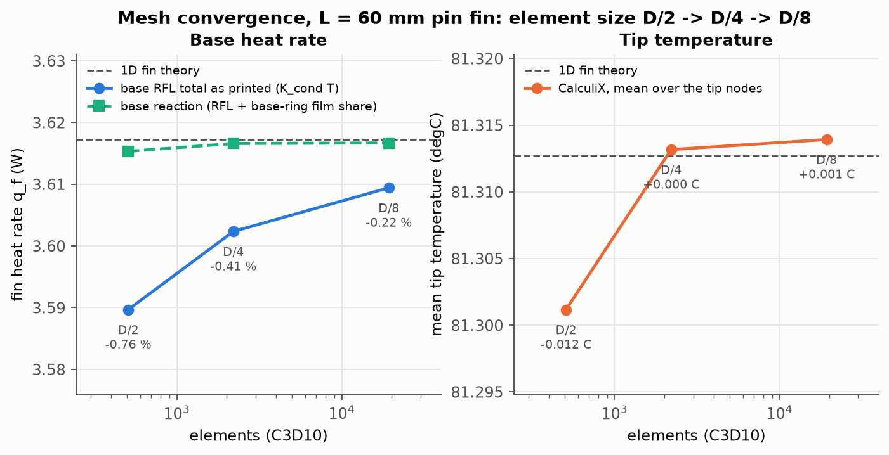
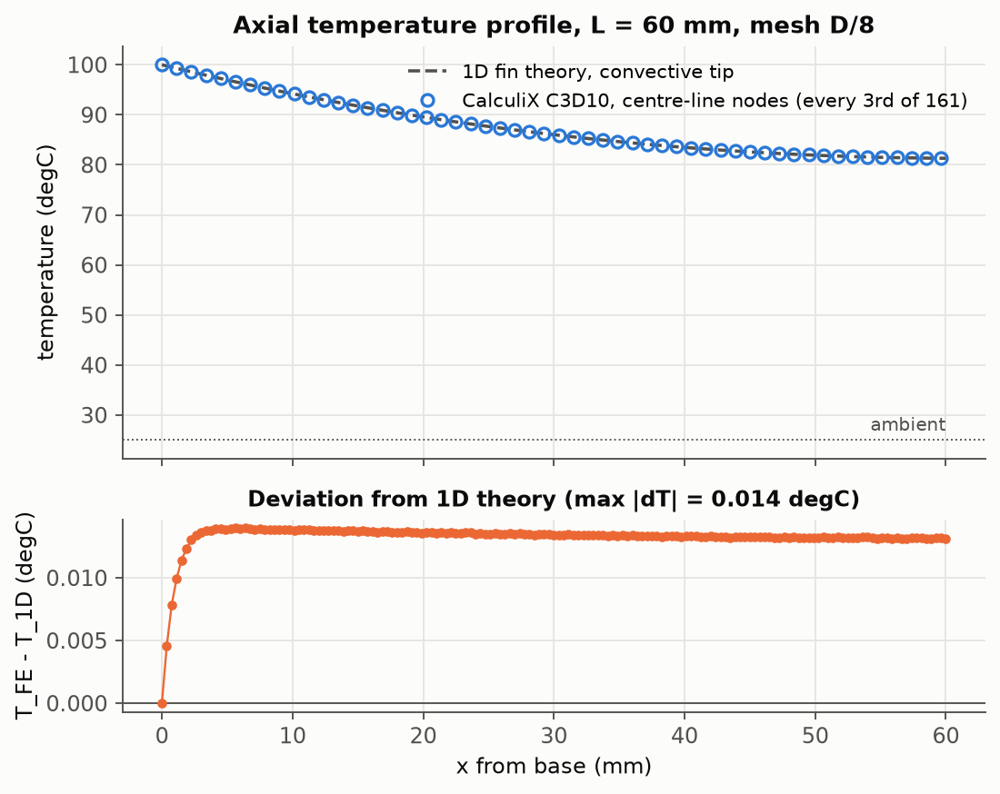
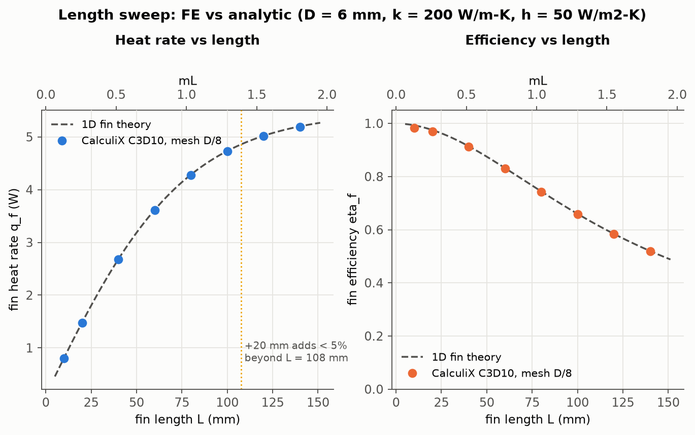
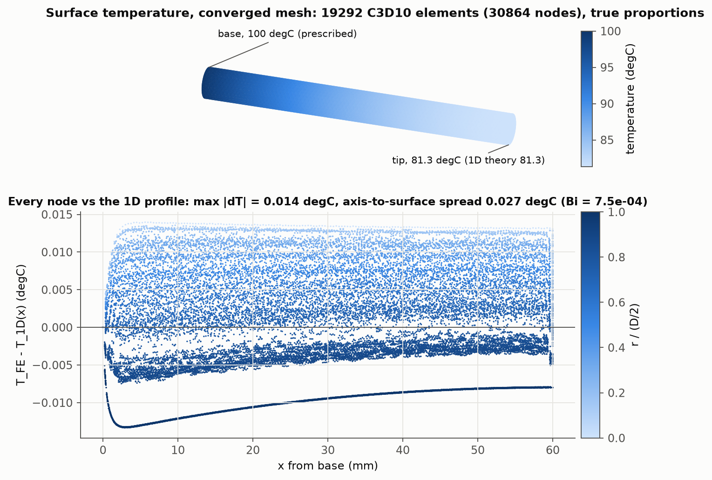

# Project 04 - Pin fin heat transfer: 3D conduction + convection vs 1D fin theory

A straight aluminium pin fin (D = 6 mm, L = 60 mm) is meshed with Gmsh, solved as a three-dimensional
steady heat-transfer problem in CalculiX, and verified against the closed-form convective-tip fin
solution (Incropera, Table 3.4 case A, `fealib.analytic.pin_fin`). One script runs a mesh-convergence
study, compares the centre-line temperature profile, sweeps the fin length from 10 to 140 mm, closes
the energy balance from the nodal results, and writes PASS/FAIL checks. A side result worth knowing is
what CalculiX's `RFL` output actually is on a convecting body, and why the printed base flux converges
only at first order in the element size.

## Model

| item | value |
|---|---|
| geometry | cylinder, D = 6 mm, axis along x, base disc at x = 0; L = 60 mm baseline, 10-140 mm in the sweep |
| material | aluminium, k = 200 W/m-K (rho = 2700 kg/m3 and cp = 900 J/kg-K are in the deck but play no role in a steady state) |
| elements | C3D10 second-order tetrahedra with curved faces (Gmsh OCC `addCylinder`, element order 2). CalculiX 2.22 accepts the structural name as-is in a `*HEAT TRANSFER, STEADY STATE` step; `DC3D10` was tried as well and gives identical results |
| base | `*BOUNDARY  BASE, 11, 11, 100` (temperature is DOF 11): T_b = 100 C |
| convection | `*FILM` on every face of LATERAL and TIP with T_inf = 25 C and h = 50 W/m2-K (5008 face lines on the D/8 baseline mesh, 357 on D/2) |
| output | `*NODE FILE  NT, RFL`; `*NODE PRINT, NSET=BASE, TOTALS=ONLY  RFL`, which puts the line `total heat generation for set BASE` in the .dat |
| meshes | target edge D/2, D/4, D/8 = 3.0, 1.5, 0.75 mm: 508 / 2203 / 19292 elements (1095 / 4356 / 30864 nodes); sweep at D/8 from 3502 elements (L = 10 mm) to 44889 (L = 140 mm) |

The physical groups BASE, TIP, LATERAL and FIN are identified by centre of mass (`fealib.mesh.cylinder_tet`);
a line embedded on the axis places nodes exactly on the centre line (161 on the D/8 mesh) for the T(x)
comparison. Gmsh runs single-threaded so a re-run reproduces the meshes and every number below exactly.
Temperatures are in degrees C throughout: conduction and convection are linear, so the offset is immaterial.

```
*INCLUDE, INPUT=mesh.inp
*MATERIAL, NAME=AL
*DENSITY
2700
*CONDUCTIVITY
200
*SPECIFIC HEAT
900
*SOLID SECTION, ELSET=EALL, MATERIAL=AL
*STEP
*HEAT TRANSFER, STEADY STATE
*BOUNDARY
BASE, 11, 11, 100
*FILM
<element>, F<face>, 25, 50          (one line per LATERAL and TIP face)
*NODE FILE
NT, RFL
*NODE PRINT, NSET=BASE, TOTALS=ONLY
RFL
*END STEP
```

## Verification

Reference: fin of uniform cross-section with convection from the tip (Incropera case A).

```
P     = pi D,   A_c = pi D^2 / 4,   theta_b = T_b - T_inf
m     = sqrt(h P / (k A_c))
M     = sqrt(h P k A_c) theta_b
q_f   = M [sinh(mL) + (h/(m k)) cosh(mL)] / [cosh(mL) + (h/(m k)) sinh(mL)]
T(x)  = T_inf + theta_b [cosh(m(L-x)) + (h/(m k)) sinh(m(L-x))] / [cosh(mL) + (h/(m k)) sinh(mL)]
eta_f = q_f / (h A_f theta_b),   A_f = pi D L + pi D^2 / 4
eps_f = q_f / (h A_c theta_b)                        (effectiveness)
Bi    = h (D/2) / k
```

Baseline (L = 60 mm): m = 12.91 1/m, mL = 0.775, q_f = 3.6173 W, eta_f = 0.8321, effectiveness = 34.1,
T_tip = 81.313 C, A_f = 1159.25 mm2, Bi = 7.5e-4.

In the FE model the fin heat rate is the total reaction flux at the prescribed-temperature base nodes.
CalculiX printed it **positive** (+3.6094 W on the D/8 mesh), i.e. positive RFL means heat flowing from
the base into the body; q_f is reported as the magnitude. The convective loss is recomputed from the
nodal temperatures as the sum over LATERAL and TIP faces of the integral of h (T - T_inf) N_i dA, using the
faces' own quadratic (curved) shape functions and a 7-point Gauss rule (`Mesh.surface_nodal_integral`).

### 1. Mesh convergence at L = 60 mm

| size   |   h (mm) |   elements |   nodes |   q_f RFL (W) |   err (%) |   q_f reaction (W) |   err (%) |   T_tip (C) |   dT_tip (C) |   max abs dT axis (C) |   q_conv / q_f RFL - 1 (%) |   ccx (s) |
|:-------|---------:|-----------:|--------:|--------------:|----------:|-------------------:|----------:|------------:|-------------:|----------------------:|---------------------------:|----------:|
| D/2    |     3.00 |        508 |    1095 |        3.5897 |    -0.762 |             3.6153 |    -0.053 |      81.301 |      -0.0115 |                0.0132 |                     +0.694 |      0.21 |
| D/4    |     1.50 |       2203 |    4356 |        3.6023 |    -0.412 |             3.6166 |    -0.018 |      81.313 |      +0.0005 |                0.0137 |                     +0.394 |      0.58 |
| D/8    |     0.75 |      19292 |   30864 |        3.6094 |    -0.216 |             3.6167 |    -0.015 |      81.314 |      +0.0012 |                0.0140 |                     +0.201 |      4.40 |



The temperature field is essentially converged on the coarsest mesh (tip temperature within 0.012 C,
centre line within 0.014 C of the 1D profile), but the printed base flux is 0.76 % low at D/2 and its error
halves with each halving of the element size: first-order convergence in a second-order element. The
"q_f reaction" column explains why and is within 0.06 % of the closed form on every mesh.

### What the printed base flux is (energy balance)

Comparing the nodal `RFL` values with the recomputed nodal film loads f_i shows that CalculiX reports
`RFL = K_cond . T`, the conduction flux vector: it is zero at interior nodes, equals -f_i at every free
node on a film surface, and at the base-ring nodes equals the Dirichlet reaction minus the film load of the
lateral faces adjacent to the base. The printed base total therefore misses the film loss of the first
element ring next to the base - an O(h) quantity (0.0256 W at D/2, 0.0073 W at D/8). Adding that share
back gives the reaction proper, which equals the integrated convective loss to solver precision:

| size   |   RFL total, base (W) |   base-ring film share (W) |   reaction (W) |   convective loss (W) |   closure (%) |   max abs(RFL_i + f_i), free nodes (W) |   max abs f_i (W) |   A_f mesh (mm2) |   A_f exact (mm2) |
|:-------|----------------------:|---------------------------:|---------------:|----------------------:|--------------:|---------------------------------------:|------------------:|-----------------:|------------------:|
| D/2    |                3.5897 |                     0.0256 |         3.6153 |                3.6146 |       2.1e-02 |                                2.0e-04 |           1.1e-02 |          1158.68 |           1159.25 |
| D/4    |                3.6023 |                     0.0143 |         3.6166 |                3.6165 |       1.6e-03 |                                1.2e-05 |           3.3e-03 |          1159.21 |           1159.25 |
| D/8    |                3.6094 |                     0.0073 |         3.6167 |                3.6167 |       9.0e-05 |                                9.9e-07 |           7.3e-04 |          1159.25 |           1159.25 |

The residual closure at D/2 (0.02 %) is the difference between CalculiX's face quadrature and the 7-point
rule on strongly curved faces (six elements around the circumference); it vanishes with refinement. The
mesh area column shows the curved C3D10 faces reproduce pi D L + pi D^2/4 to 0.05 % even at D/2.
Practical consequence: as printed, the base `RFL` total is a lower bound on q_f that converges at first
order; the corrected reaction or the integrated convective loss is mesh-insensitive.

### 2. Centre-line temperature profile (D/8 mesh)



The 161 centre-line nodes follow the 1D curve to within 0.014 C. The deviation is systematic, not noise:
the 1D solution is the section-mean temperature, and the axis of a convecting cylinder runs hotter than
the surface by a parabolic profile of height h theta (D/2) / (2 k), which is 0.028 C at the base
temperature; the FE axis-to-surface spread is 0.027 C (bottom panel of the last figure).

### 3. Length sweep at the converged element size

|   L (mm) |    mL |   elements |   q_f FE (W) |   q_f analytic (W) |   err (%) |   eta_f FE |   eta_f analytic |   T_tip FE (C) |   T_tip analytic (C) |   q_conv / q_f - 1 (%) |
|---------:|------:|-----------:|-------------:|-------------------:|----------:|-----------:|-----------------:|---------------:|---------------------:|-----------------------:|
|       10 | 0.129 |       3502 |       0.7992 |             0.8070 |    -0.968 |     0.9831 |           0.9927 |          99.19 |                99.19 |                 +0.961 |
|       20 | 0.258 |       6639 |       1.4741 |             1.4819 |    -0.525 |     0.9700 |           0.9751 |          97.21 |                97.21 |                 +0.511 |
|       40 | 0.516 |      13118 |       2.6738 |             2.6817 |    -0.294 |     0.9115 |           0.9142 |          90.40 |                90.40 |                 +0.279 |
|       60 | 0.775 |      19292 |       3.6094 |             3.6173 |    -0.216 |     0.8303 |           0.8321 |          81.31 |                81.31 |                 +0.201 |
|       80 | 1.033 |      25745 |       4.2774 |             4.2852 |    -0.182 |     0.7425 |           0.7438 |          71.70 |                71.69 |                 +0.168 |
|      100 | 1.291 |      32277 |       4.7248 |             4.7327 |    -0.167 |     0.6585 |           0.6596 |          62.72 |                62.72 |                 +0.154 |
|      120 | 1.549 |      38127 |       5.0120 |             5.0197 |    -0.153 |     0.5836 |           0.5845 |          54.96 |                54.96 |                 +0.141 |
|      140 | 1.807 |      44889 |       5.1910 |             5.1988 |    -0.152 |     0.5190 |           0.5198 |          48.54 |                48.54 |                 +0.141 |



q_f (printed RFL) and eta_f = q_f / (h A_f theta_b) track the closed form at every length; the FE value
sits below it by the base-ring share, a near-constant 0.0071-0.0077 W that shrinks from 0.97 % of q_f at
L = 10 mm to 0.15 % at L = 140 mm. Efficiency falls monotonically from 0.98 to 0.52 as mL grows from 0.13 to 1.81.
The 60 mm point reuses the D/8 run of the convergence study (identical inputs).

**Diminishing returns.** Gain in heat rate from adding 20 mm of fin:

|   L from (mm) |   L to (mm) |   q_f gain FE (%) |   q_f gain analytic (%) |
|--------------:|------------:|------------------:|------------------------:|
|            20 |          40 |             81.38 |                   80.96 |
|            40 |          60 |             34.99 |                   34.89 |
|            60 |          80 |             18.51 |                   18.47 |
|            80 |         100 |             10.46 |                   10.44 |
|           100 |         120 |              6.08 |                    6.07 |
|           120 |         140 |              3.57 |                    3.57 |

On the analytic curve (0.5 mm grid) adding 20 mm buys less than 5 % beyond **L = 107.5 mm** (mL = 1.39);
the FE sweep brackets the same point between 100 and 120 mm (+6.08 % for 100 to 120 mm, +3.57 % for
120 to 140 mm). Beyond about 110 mm the extra aluminium is better spent on more fins than on longer ones.

### 4. Temperature field



Surface faces of the converged mesh coloured by temperature in an orthographic view at true proportions
(top), and the deviation of every one of the 30864 nodes from the 1D profile at its own x (bottom). The
whole 3D field lies within 0.014 C of the 1D solution; the colour (radial position) resolves the 0.027 C
parabolic section profile that 1D theory averages out.

## Checks

All from `results/summary.json` (the script exits 1 if any fails):

| check | result |
|---|---|
| converged (D/8) fin heat rate q_f within 1.5 % of the analytic convective-tip solution (-0.216 %) | PASS |
| converged (D/8) mean tip temperature within 0.5 C of analytic (+0.0012 C) | PASS |
| centre-line profile T(x): max abs(T_FE - T_1D) < 0.5 C on the converged mesh (0.014 C) | PASS |
| q_f converges monotonically (one-signed, shrinking changes D/2 -> D/4 -> D/8) | PASS |
| length sweep: FE fin efficiency decreases monotonically with L | PASS |
| energy balance: printed base flux equals the recomputed convective loss within 2 % on the converged mesh (0.20 %) | PASS |
| energy balance, exact form: base reaction (RFL + base-ring film share) equals the convective loss within 0.01 % (9e-5 %) | PASS |
| RFL interpretation: at every free film node RFL = -(nodal film load) within 1 % of the largest nodal load (9.9e-7 W vs 7.3e-4 W) | PASS |
| base heat rate from the .dat TOTALS line matches the sum of nodal RFL in the .frd (all runs, < 1e-4) | PASS |

## How to run

```
cd computational-mechanics-portfolio && source .venv/bin/activate
export OMP_NUM_THREADS=2 CCX_NPROC_STIFFNESS=2 CCX_NPROC_RESULTS=2
python projects/04_pin_fin_heat_transfer/run.py
```

Ten CalculiX solves (3 convergence + 7 sweep; the 60 mm sweep point reuses the D/8 run). This run took 79 s
wall time on a laptop with the CPU shared with other jobs (38 s on an idle machine in an earlier run); the largest
solve (44889 elements, L = 140 mm) took 10 s.
`results/` holds the figures, `convergence.csv`, `length_sweep.csv`, `axial_profile.csv`, the Markdown
tables above and `summary.json`; `work/` keeps every deck, mesh, `.frd` and `.dat` (git-ignored).
Requires Gmsh (pip) and a `ccx` binary found by `fealib.ccx.find_ccx()`.

## Engineering notes

- **1D fin theory needs Bi << 1 across the section.** Here Bi = h (D/2) / k = 7.5e-4, so the section is
  isothermal to 0.027 C and the 1D model is exact for practical purposes: the 3D reaction differs from
  the closed form by only -0.015 %, an O(Bi) effect. The comparison would degrade for steel (k ~ 50) or
  large h (boiling, jet impingement).
- **Radiation neglected.** The linearised radiative coefficient at the base temperature,
  h_r = eps sigma (T_s^2 + T_inf^2)(T_s + T_inf), is 0.43 W/m2-K for polished aluminium (eps = 0.05) but
  6.95 W/m2-K for an anodised or painted surface (eps = 0.8): 0.9 % and 14 % of the h used. A painted fin
  in still air should carry radiation as an added h (or a `*RADIATE` card).
- **Uniform h assumed.** A real fin sees h vary along its length and around its circumference (developing
  boundary layer, orientation in natural convection, tip and base interference in an array); h = 50 W/m2-K
  is representative of forced air. Because q_f scales roughly with sqrt(h) for a long fin, an uncertainty
  band on h propagates into q_f at half its size.
- **Base temperature idealised.** The base disc is held at a uniform 100 C. With an effectiveness of 34 the
  fin draws 34 times the heat the bare base area would, so the spreading and contact resistance in the wall
  behind it can lower the real base temperature noticeably; a wall-plus-fin model would capture that.
- **Reading solver output.** The `RFL` total at the fixed-temperature nodes is a first-order lower bound on
  q_f (-0.76 % at D/2, -0.22 % at D/8 here). For a mesh-insensitive heat rate use the integrated
  convective loss or add the film share of the base-ring nodes back to the reaction, as done above.
