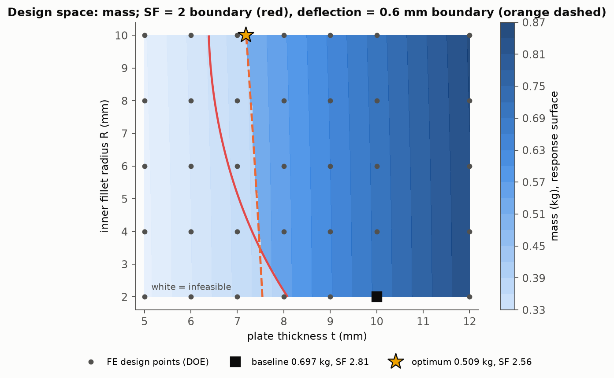
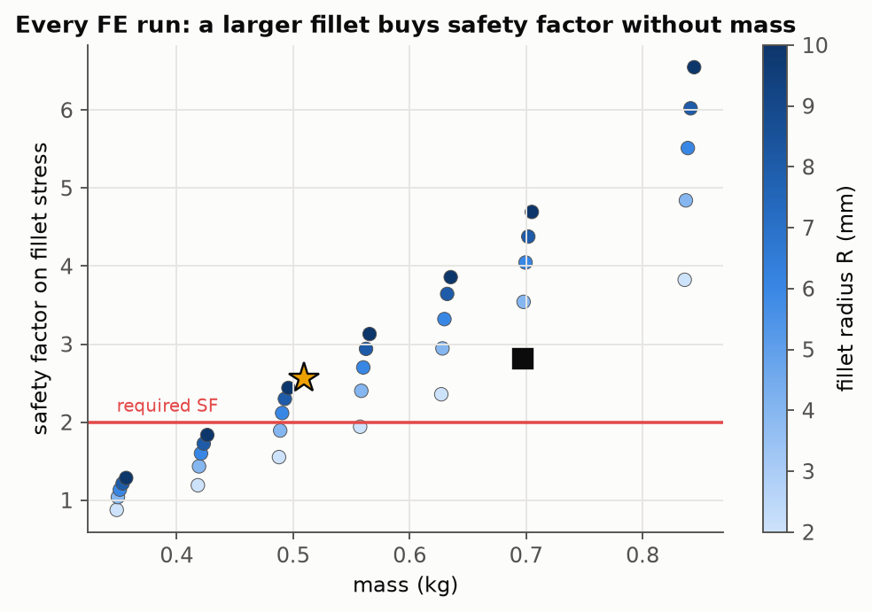
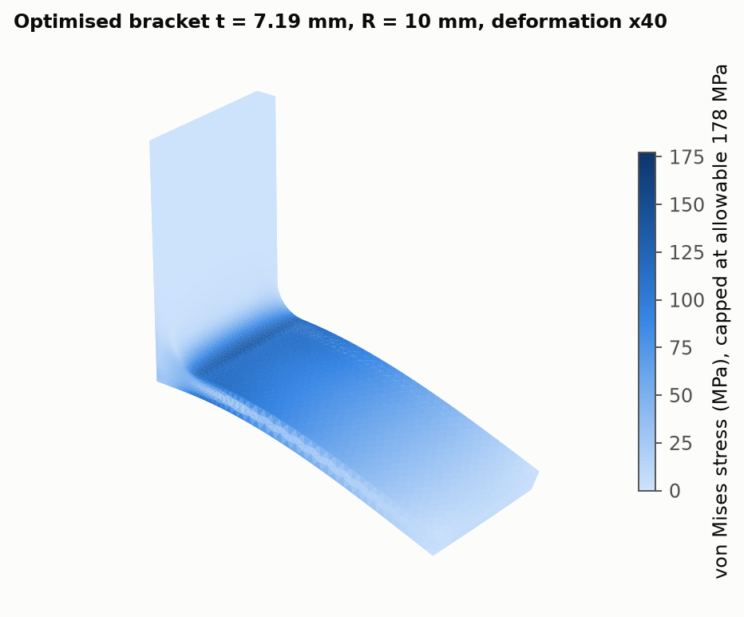
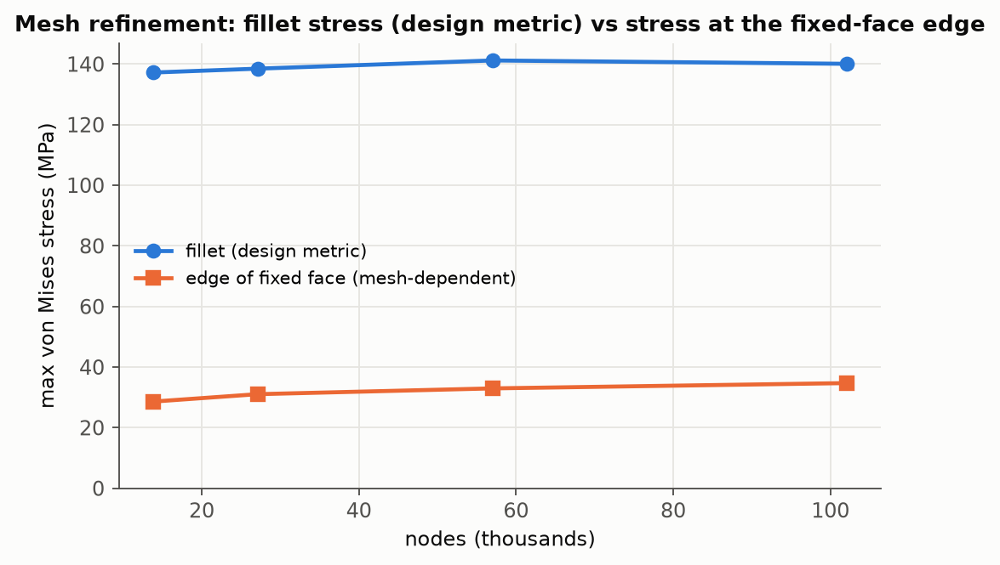

# 05 · L-bracket design optimisation: CadQuery → Gmsh → CalculiX → response surface → SciPy

**Question answered.** For a wall-mounted L-bracket carrying a 600 N load at the end of its arm, what
combination of plate thickness and inner fillet radius gives the lightest part that still has a safety
factor of 2 on yield and deflects less than 0.6 mm, and can that optimum be trusted?

The geometry is code ([`bracket.py`](bracket.py), CadQuery), so every design point is regenerated from two
numbers, exported to STEP, meshed with Gmsh (second-order tetrahedra, distance-based refinement on the
fillet), solved in CalculiX and post-processed in Python. [`run.py`](run.py) runs a 7 × 5 design of
experiments (35 finite-element solutions), fits quadratic response surfaces, minimises mass under the two
constraints with SLSQP, verifies the optimum with a direct FE run, and checks mesh convergence of the
stress that drives the design.

## Model and requirements (mm–N–MPa unit system, E = 200 000 MPa)

| Item | Value |
|---|---|
| Geometry | vertical plate 80 mm high × 50 mm wide, arm 100 mm long, two Ø9 mounting holes, inner fillet radius R, thickness t |
| Load | 600 N downward on the arm's end face, applied as a uniform traction through consistent nodal loads |
| Boundary condition | back face of the plate fixed (bolted to a rigid wall) |
| Material | S355 structural steel, S<sub>y</sub> = 355 MPa, ν = 0.30, ρ = 7850 kg/m³ |
| Requirements | SF = S<sub>y</sub> / σ<sub>vM,fillet</sub> ≥ 2.0, tip deflection ≤ 0.60 mm, t ∈ [5, 12] mm, R ∈ [2, 10] mm |
| Design metric | maximum von Mises stress on the fillet surface (the design feature); the stress at the edge of the fixed face is singular by construction and is reported but excluded, see below |
| Mesh | C3D10 tetrahedra, 6 mm global size, fillet refined to R/6 (≥ 0.5 mm) by a distance-threshold field, 14 000–29 000 elements per design point |
| Baseline for comparison | t = 10 mm, R = 2 mm: the "thick plate, small fillet" design |

## Design of experiments and response surfaces

35 CalculiX solutions on t ∈ {5, 6, 7, 8, 9, 10, 12} × R ∈ {2, 4, 6, 8, 10} mm; every run balances the
600 N reaction to machine precision. Full table: [`results/doe.md`](results/doe.md), data
[`results/doe.csv`](results/doe.csv).

Quadratic surfaces in (t, R) are fitted to log σ<sub>fillet</sub>, log δ and mass: R² = 0.9989 (stress,
largest residual 3.6 %), 0.9996 (deflection, 2.2 %) and 1.0000 (mass, exact because the volume is
quadratic in t and R).





The scatter of every FE run tells the design story: at fixed thickness the fillet radius buys 30–60 % of
safety factor for less than 1 % of mass, so the constraint boundary bends toward thinner plates with large
fillets. At R = 10 mm the stress constraint is satisfied from t ≈ 6.4 mm, and the deflection limit takes
over as the active constraint.

## Optimum and verification

| | Surrogate prediction | Direct FE run |
|---|---|---|
| t, R | 7.19 mm, 10.0 mm | 7.19 mm, 10.0 mm |
| mass | 0.5092 kg | 0.5092 kg |
| safety factor on fillet stress | 2.505 | **2.563** (σ<sub>vM</sub> = 138.5 MPa) |
| tip deflection | 0.600 mm | **0.590 mm** |

The verified optimum satisfies both requirements without a corrective iteration and weighs **0.509 kg
against 0.697 kg for the baseline: 26.9 % lighter**, with the deflection limit active and the stress
constraint slack. The baseline has SF 2.81 and deflects 0.265 mm, i.e. it spends 0.19 kg on stiffness the
requirement does not ask for.



## Mesh convergence at the optimum

| global size / fillet divisions | nodes | fillet σ<sub>vM</sub> (MPa) | stress at fixed-face edge (MPa) | deflection (mm) |
|---|---:|---:|---:|---:|
| 8 mm / 4 | 13 855 | 137.2 | 28.6 | 0.5894 |
| 6 mm / 6 | 27 094 | 138.5 | 31.1 | 0.5900 |
| 4 mm / 8 | 56 999 | 141.2 | 33.0 | 0.5903 |
| 3 mm / 10 | 102 062 | 140.1 | 34.7 | 0.5905 |



The fillet stress moves by 0.8 % between the two finest meshes and the deflection by 0.03 %, so the
6 mm / 6 mesh used for the DOE is adequate for a 2 % design decision. The stress at the edge of the fixed
face grows by 21 % over the same series and would keep growing: a fully fixed face meeting a free surface
is a stress singularity, and its value is a property of the mesh, not of the part. It is far below the
fillet stress here, but it is exactly the number an unreviewed contour plot would report as "maximum".

## Checks (all PASS in the committed run)

- equilibrium: fixed-face reaction equals the applied load in every run (< 1e-6)
- response surfaces fit the FE data (R² > 0.99 for stress and deflection)
- verified optimum meets SF ≥ 2.0 and deflection ≤ 0.6 mm in a direct FE run
- verified optimum is lighter than the baseline design
- fillet stress converged: < 3 % change between the two finest meshes

## How to run

```bash
cd projects/05_bracket_design_optimization
python run.py          # 35 DOE + 2 verification + 4 convergence solves, about 8-10 min on a laptop
```

Needs CadQuery (`pip install -e .` at the repository root installs it), Gmsh and a `ccx` executable.
The geometry of the optimum is exported to [`results/bracket_optimum.svg`](results/bracket_optimum.svg).

## Engineering notes and limitations

- The fixed back face is an idealisation of a bolted joint; a real joint is more compliant and puts the
  bolts, not the plate edge, in the load path. Bolt bearing and preload were not part of the study.
- Linear elastic, small displacement; the 26.9 % saving assumes the load case is the only one. Fatigue
  would change the picture, since the fillet is also where the stress range is highest.
- A quadratic response surface is a local model of a smooth design space; with more variables or a
  non-smooth response (contact, buckling) a direct FE-in-the-loop optimiser would replace it.
- The mesh nondeterminism of parallel tetrahedral meshing is avoided by running Gmsh single-threaded, so
  every number above reproduces exactly on a rerun.
