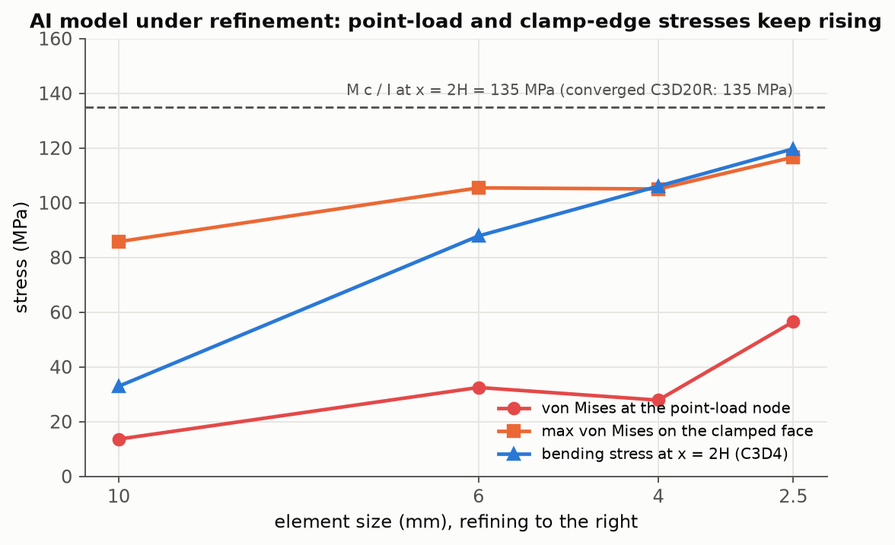

# 06 · Reviewing an AI-generated FEA solution

**Question answered.** Given an AI system's finite-element answer to a simple engineering task, can the
review be made objective and reproducible: which of its numbers are wrong, why, by how much, and what
checks would have caught each error without knowing the answer in advance?

This project mirrors the work of validating machine-generated engineering solutions. It contains:

- [`task.md`](task.md) – the task as posed to the AI system
- [`ai_solution.py`](ai_solution.py) – the AI-generated solution, kept as generated (it runs)
- [`results/ai_report.md`](results/ai_report.md) – the report that solution prints
- [`run.py`](run.py) – the executable review: reruns the submission, refines its mesh, builds the
  corrected reference model, and applies eight objective checks with evidence
- [`REVIEW.md`](REVIEW.md) – the written expert review with severity ratings and the corrected values

## Headline

| | AI submission | Corrected / reference |
|---|---|---|
| Maximum stress | 85.8 MPa, at a clamp-face node, single 10 mm C3D4 mesh | 150 MPa nominal at the root (`M c / I`); FE 135.0 MPa at x = 2H vs 135.0 MPa theory |
| Tip deflection | 0.0000 mm ("negligible") | 3.992 mm (Timoshenko 4.008 mm) |
| Safety factor | 5.01 on ultimate strength | 1.83 on yield |
| Own validation | "reaction = load, model is correct" | equilibrium passes for every wrong mesh too |

Refining the AI model shows why its numbers cannot be trusted: the reported maximum moves from 85.8 to
138.5 MPa (+62 %) between 10 mm and 2.5 mm elements, the point-load node stress rises from 13.6 to
56.5 MPa, and the linear tetrahedra still under-predict the bending stress at x = 2H by 11 % at
49 556 elements.



Details, severities and the check-by-check evidence are in [`REVIEW.md`](REVIEW.md).

## How to run

```bash
cd projects/06_ai_solution_review
python run.py          # ~2 min: 4 refinement runs of the AI model + 1 corrected model
```

The script exits 0 when the corrected reference model agrees with theory (it does: 0.0 % on stress,
0.4 % on deflection). The AI solution's check results are written to
[`results/review_checks.md`](results/review_checks.md).

## Why the example is built this way

The errors planted in the AI solution are the ones that recur in practice: mixed unit systems that leave
stresses plausible and displacements absurd; a single-mesh result reported from a singular location;
linear tetrahedra in bending; nodal point loads on solids; and a safety factor against the wrong
strength. The refinement series is deterministic (single-threaded Gmsh), so the numbers above reproduce
exactly on a rerun.
