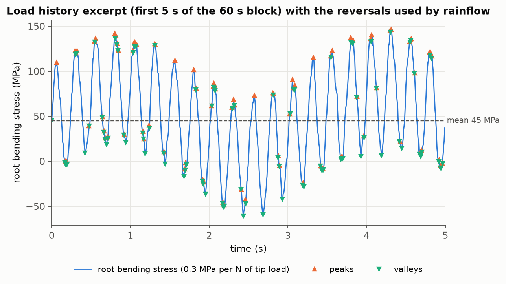
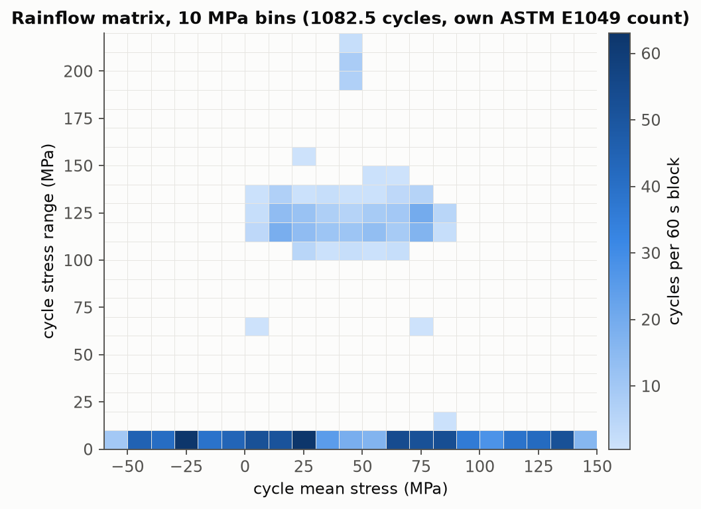
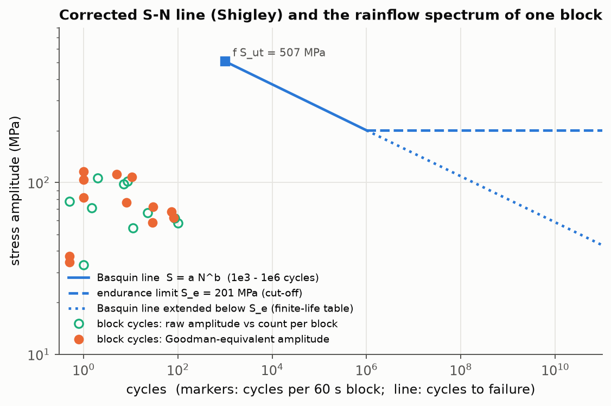

# 07 - Fatigue life estimation under variable-amplitude loading

Stress-life fatigue assessment of the project-01 cantilever (steel, L = 0.4 m, 20 x 20 mm section) under a
synthetic 60 s variable-amplitude tip-load history: own ASTM E1049 rainflow counting cross-checked against
the `rainflow` package, a Shigley S-N line with Marin factors, four mean-stress corrections, and
Palmgren-Miner damage summation. Everything is scripted in Python; every number below is written by `run.py`.

## Purpose

- Implement rainflow counting from the standard (ASTM E1049-85, 5.4.4) and prove it against an independent
  implementation and the standard's own worked example.
- Build a textbook S-N line (Shigley) with the Marin correction factors actually evaluated for this part.
- Show how much the choice of mean-stress correction (Goodman, Gerber, Soderberg, Smith-Watson-Topper) moves a
  Miner life estimate for the same counted spectrum.
- Verify the whole chain with a constant-amplitude case whose answer is known in closed form.

## Method

**Component and stress.** Root bending stress per newton of tip load: sigma / P = L (h/2) / I with
I = b h^3 / 12 = 1.333e-8 m^4, giving 0.3 MPa/N (150 MPa at the 500 N load of project 01).

**Material (assumed).** AISI 1045-like normalised steel, S_ut = 585 MPa, S_y = 310 MPa, machined surface, room
temperature, 90 % reliability.

**Load history.** 60 s at 200 Hz (12 000 samples): 150 N mean + 200 N sinusoid at 4 Hz + 120 N sinusoid at
0.3 Hz + Gaussian noise (sigma = 40 N, seed 7) smoothed with a 5-sample moving average. Converted to root stress
with 0.3 MPa/N and saved to `results/load_history.csv`. Range: -202.3 to 511.6 N, i.e. -60.7 to 153.5 MPa.

**Rainflow counting (`fatigue.rainflow_cycles`).** The history is reduced to its reversals (first and last
samples kept, plateaus collapsed, interior samples kept where the slope changes sign). Reversals are pushed onto
a stack; with three or more present the newest range X = |p[-1] - p[-2]| is compared with Y = |p[-2] - p[-3]|:
if X < Y the next reversal is read; if X >= Y and Y contains the starting point, Y is a half cycle and the
starting point is dropped; otherwise Y is a closed loop counted as one full cycle and its two points are
removed. Leftover ranges at the end are half cycles. Each cycle is stored as (range, mean, count).
The reference is `rainflow` 3.2.0 (`extract_cycles`), which implements the same clause of the standard.

**S-N line (`fatigue.basquin_sn`, Shigley 9th ed. Ch. 6).**

```
S_e' = 0.5 S_ut                          = 292.5 MPa            (rotating-beam estimate, S_ut <= 1400 MPa)
k_a  = 4.51 S_ut^-0.265                  = 0.8335               (machined surface, S_ut in MPa)
d_e  = 0.808 sqrt(h b)                   = 16.16 mm             (rectangle in non-rotating bending)
k_b  = 1.24 d_e^-0.107                   = 0.9207               (2.79 <= d_e <= 51 mm)
k_c  = 1 (bending)   k_d = 1 (room temperature)   k_e = 0.897 (90 % reliability)
S_e  = k_a k_b k_c k_d k_e S_e'          = 201.3 MPa            (Marin equation)
f    = fatigue strength fraction at 1e3  = 0.8673   ->  f S_ut = 507.3 MPa
a    = (f S_ut)^2 / S_e                  = 1278.5 MPa
b    = -log10(f S_ut / S_e) / 3          = -0.1338
S(N) = a N^b   (1e3 <= N <= 1e6),        N(S) = (S / a)^(1/b)
```

The fraction f follows Shigley's Fig. 6-18, which is generated from sigma_F' = S_ut + 345 MPa,
b_F = -log10(sigma_F'/S_e') / log10(2e6) and f = (sigma_F'/S_ut) (2e3)^b_F; for S_ut < 490 MPa the figure is not
drawn and f = 0.9 is used instead (not the case here, 585 MPa gives f = 0.8673).

**Mean-stress corrections (`fatigue.equivalent_fully_reversed`).** Each counted cycle (amplitude sigma_a =
range/2, mean sigma_m) is converted to the fully reversed amplitude sigma_ar that would do the same damage:

```
Goodman    sigma_a/S_e + sigma_m/S_ut = 1      =>  sigma_ar = sigma_a / (1 - sigma_m/S_ut)
Gerber     sigma_a/S_e + (sigma_m/S_ut)^2 = 1  =>  sigma_ar = sigma_a / (1 - (sigma_m/S_ut)^2)
Soderberg  sigma_a/S_e + sigma_m/S_y = 1       =>  sigma_ar = sigma_a / (1 - sigma_m/S_y)
SWT        sigma_ar = sqrt(sigma_max sigma_a),  sigma_max = sigma_m + sigma_a
```

Compressive means give no benefit in Goodman, Gerber and Soderberg (sigma_m < 0 is evaluated as 0). SWT keeps
its own definition, which credits a compressive mean through sigma_max and gives sigma_ar = 0 when
sigma_max <= 0.

**Palmgren-Miner damage (`fatigue.miner_damage`).** D = sum_i n_i / N_i over the cycles of one 60 s block,
life = 1/D blocks. Two variants are reported: with the endurance-limit cut-off (cycles with sigma_ar <= S_e are
non-damaging, Shigley's infinite-life criterion, the default) and with the Basquin line extended below S_e
(the "elementary" Miner rule, every cycle contributes; `infinite_life=False`).

## Results

### Rainflow count: own implementation vs the `rainflow` package

2166 reversals, 1090 counted ranges, 1082.5 cycles per 60 s block from both implementations; the largest range is
214.15 MPa. Per-bin counts are identical in every 10 MPa bin:

| range bin (MPa)   |   own count |   rainflow 3.2.0 count |   difference |
|:------------------|------------:|-----------------------:|-------------:|
| 0-10              |       841.0 |                  841.0 |          0.0 |
| 10-20             |         1.0 |                    1.0 |          0.0 |
| 20-30             |         0.0 |                    0.0 |          0.0 |
| 30-40             |         0.0 |                    0.0 |          0.0 |
| 40-50             |         0.0 |                    0.0 |          0.0 |
| 50-60             |         0.0 |                    0.0 |          0.0 |
| 60-70             |         1.0 |                    1.0 |          0.0 |
| 70-80             |         0.0 |                    0.0 |          0.0 |
| 80-90             |         0.0 |                    0.0 |          0.0 |
| 90-100            |         0.0 |                    0.0 |          0.0 |
| 100-110           |        11.0 |                   11.0 |          0.0 |
| 110-120           |       100.5 |                  100.5 |          0.0 |
| 120-130           |        85.5 |                   85.5 |          0.0 |
| 130-140           |        23.0 |                   23.0 |          0.0 |
| 140-150           |         1.5 |                    1.5 |          0.0 |
| 150-160           |         0.5 |                    0.5 |          0.0 |
| 160-170           |         0.0 |                    0.0 |          0.0 |
| 170-180           |         0.0 |                    0.0 |          0.0 |
| 180-190           |         0.0 |                    0.0 |          0.0 |
| 190-200           |         7.0 |                    7.0 |          0.0 |
| 200-210           |         8.5 |                    8.5 |          0.0 |
| 210-220           |         2.0 |                    2.0 |          0.0 |
| total             |      1082.5 |                 1082.5 |          0.0 |

The spectrum reads as expected: 841 small noise cycles under 10 MPa, about 220 cycles of the 4 Hz load at
100-140 MPa range, and 17.5 large cycles (190-220 MPa range) where the 4 Hz and 0.3 Hz waves add.
The implementation also reproduces the worked example of ASTM E1049-85 section 5.4.4 exactly
(ranges 3, 4, 6, 8, 9 -> 0.5, 1.5, 0.5, 1.0, 0.5 cycles).





### Endurance-limit screening (cut-off variant)

| method    |   max sigma_ar (MPa) |   S_e / max sigma_ar |   cycles above S_e |   D per block | life     |
|:----------|---------------------:|---------------------:|-------------------:|--------------:|:---------|
| Goodman   |                116.3 |                1.731 |                  0 |             0 | infinite |
| Gerber    |                107.8 |                1.868 |                  0 |             0 | infinite |
| Soderberg |                125.9 |                1.599 |                  0 |             0 | infinite |
| SWT       |                128.2 |                1.571 |                  0 |             0 | infinite |

The largest corrected amplitude in the block (128.2 MPa, SWT) is below S_e = 201.3 MPa for every method, so with
the endurance-limit cut-off no cycle is damaging and the stress-life prediction is infinite life, with a margin
of 1.57 to 1.87 on the endurance limit.

### Miner life with the Basquin line extended below S_e (elementary Miner rule)

| method    |   D per block |   life (blocks) |   life (h) |   life (cycles) |   life / Goodman life |
|:----------|--------------:|----------------:|-----------:|----------------:|----------------------:|
| Goodman   |     2.407e-07 |       4.154e+06 |  6.924e+04 |       4.497e+09 |                1      |
| Gerber    |     1.369e-07 |       7.306e+06 |  1.218e+05 |       7.909e+09 |                1.759  |
| Soderberg |     4.495e-07 |       2.225e+06 |  3.708e+04 |       2.408e+09 |                0.5356 |
| SWT       |     6.911e-07 |       1.447e+06 |  2.412e+04 |       1.566e+09 |                0.3483 |

One block is 60 s and carries 1082.5 cycles. The four corrections span a factor of 5.05 in life
(SWT 24 100 h to Gerber 121 800 h); Goodman sits in the middle at 69 200 h (4.15 million blocks,
4.50e9 cycles). Gerber is the least conservative because its parabola credits the tensile means least: its largest
corrected amplitude is 107.8 MPa against a raw maximum amplitude of 107.1 MPa (half of the 214.15 MPa range).
SWT is the most conservative here because sqrt(sigma_max sigma_a) = sigma_a sqrt(1 + sigma_m/sigma_a) grows
faster with the mean than the Goodman factor 1 / (1 - sigma_m/S_ut) at these moderate amplitudes: its largest
corrected amplitude is 128.2 MPa versus 116.3 MPa for Goodman.



### Constant-amplitude sanity check

A zero-mean 4 Hz cosine sampled at 200 Hz for 40 periods, starting and ending on a peak, is pushed through the
same rainflow + Goodman + Miner chain. It counts 40 cycles and its life must equal N(S) from the S-N line:

|   amplitude_MPa | infinite_life   |   cycles_counted |         N_curve |     life_cycles |    rel_diff |
|----------------:|:----------------|-----------------:|----------------:|----------------:|------------:|
|             200 | False           |               40 |     1.05094e+06 |     1.05094e+06 | 0           |
|             300 | True            |               40 | 50752.6         | 50752.6         | 2.22045e-16 |

200 MPa sits 0.7 % below S_e = 201.3 MPa, so with the cut-off both sides would be infinite; the 200 MPa case is
therefore evaluated on the extended Basquin line (N = 1.051e6 cycles, just past the 1e6 knee) and the 300 MPa case
with the cut-off active (N = 50 753 cycles).

## Checks

All nine checks pass (`results/summary.json`, exit code 0):

| check | result |
|:------|:------:|
| own rainflow reproduces the ASTM E1049-85 worked example (ranges 3/4/6/8/9 -> 0.5/1.5/0.5/1.0/0.5 cycles) | PASS |
| rainflow total cycle count equals the `rainflow` package (difference < 1e-9; both 1082.5) | PASS |
| rainflow 10 MPa range histogram identical to the `rainflow` package in every bin | PASS |
| constant-amplitude 200 MPa cosine: rainflow + Miner life equals N(200 MPa) within 1e-9 (extended Basquin line) | PASS |
| constant-amplitude 300 MPa cosine: rainflow + Miner life equals N(300 MPa) within 1e-9 (with the S_e cut-off) | PASS |
| endurance-limit screening: every corrected amplitude is below S_e, so the cut-off variant gives D = 0 for all methods | PASS |
| Miner damage per block (extended Basquin line) is positive and finite for all four methods | PASS |
| Goodman is at least as conservative as Gerber (life_goodman <= life_gerber: 4.154e6 <= 7.306e6 blocks) | PASS |
| all four mean-stress methods agree within a factor of 10 (max/min life = 5.05) | PASS |

## How to run

```
cd /path/to/computational-mechanics-portfolio && source .venv/bin/activate
cd projects/07_fatigue_life_estimation && python run.py
```

Runs in well under a second (0.4-0.6 s reported by the script over several runs, about 1.3 s wall clock with
interpreter start-up) and rewrites `results/`: `load_history.csv`,
`rainflow_cycles.csv`, `rainflow_comparison.csv/.md`, `endurance_screening.md`, `miner_life.csv/.md`,
`constant_amplitude_check.md`, the three figures and `summary.json` (inputs, S-N constants, damage per method
and the PASS/FAIL dictionary). The exit code is 1 if any check fails. No FE solver is needed.
`fatigue.py` is importable on its own (`rainflow_cycles`, `basquin_sn`, `equivalent_fully_reversed`,
`miner_damage`, Marin helpers).

## Limitations

- Stress-life only: nominal root bending stress with no notch factor (K_f), no stress gradient and no
  plasticity correction; the Basquin line is not valid below 1e3 cycles (amplitudes above f S_ut).
- The material properties, surface finish and reliability are assumed, not measured; the S-N line is a textbook
  estimate (Shigley), not test data for this part.
- The load history is synthetic and deterministic; a real spectrum would need measured loads and a long enough
  record to capture rare large cycles.
- Miner's rule is linear: no load-sequence, overload or crack-closure effects, and the "extended" life numbers
  rest on the assumption that cycles below the endurance limit still damage (elementary Miner rule); with the
  textbook cut-off the same spectrum gives infinite life.
- Mean-stress corrections are applied per cycle with the conservative compressive-mean convention stated above;
  results are only as good as that convention for spectra with significant compressive excursions.
